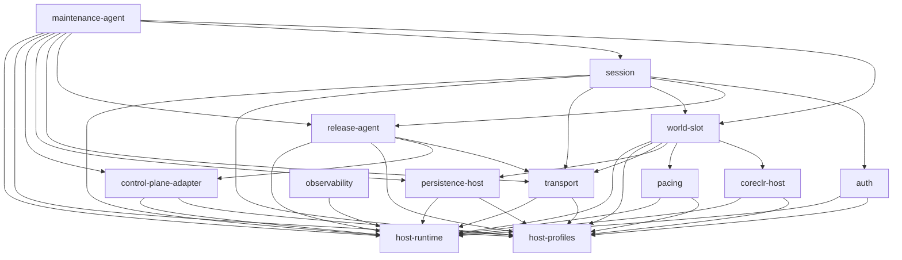

# LumioServer Framework Implementation Design

> 日期：2026-08-27  
> 架构基线：`LGE-V1.2-2026-08-27`  
> 交付性质：实现级模块设架 + 可验收任务卡；不包含生产功能代码。  
> 权威顺序：`.spec` 治理 → `modules/README.md` 三图/所有权/队列 → 各模块 README → 架构源只读镜像 → task/skill 规范。

## 0. 结论与落地边界

本设计把现有 15 个一等模块一对一下沉到 14 个可编译 crate、1 个薄 binary 和 1 个零实现封锁目录；不合并、不拆分、不复活旧模块名。Foundation 的可运行垂直骨架以 `LocalEmbedded` 为正向路径：它允许绕过 Socket/TLS/OS carrier，但仍必须经过 generated Schema、Codec、Envelope、认证/权限、大小限制、有界队列和 Runtime Tick Barrier。

RemoteDS 的 vendor-neutral core 可以立即实现；生产 Remote carrier、控制面通道和认证 wire 分别受 D-004、D-010、D-011 约束。`protocol-dispatch` 受 D-009 硬封锁，不创建 crate、src、trait 或测试替身。

## 1. 校准：不重画模块地图

### 1.1 本仓拥有 / 不拥有

**本仓拥有：** Rust Dedicated Server Host 的进程、单调时钟与受监督执行、连接/队列、认证行为、服务端 Session admission、本进程 Release 身份、`WorldSlotHost` 聚合根、pacing、CoreCLR hosting、本地持久化编排、维护代理、控制面 adapter、可观测性和 Host profile。

**本仓不拥有：** ECS/Voxel/Game 权威数据、Logical Tick phase、Gameplay 规则、Client replica、集群 desired state、Pool 是否存在、实例替换时机、目标实例激活、公共 Schema/ABI/ID/ErrorCode/FaultClass 语义。

### 1.2 15 个模块一句话校准

| 模块 | 优先级 | 层 | 一句话职责 |
| --- | --- | --- | --- |
| process | P0 | 组装根 | 进程入口、配置、信号、进程级 Watchdog、显式端口接线、退出 |
| host-runtime | P0 | 基础 | 单调时钟、Timer 投递、取消树、监督、有界执行/端口 |
| transport | P0 | 平台 | 连接注册表、Envelope 机械校验、Ingress/Egress、carrier adapters |
| auth | P0 | 平台 | 不透明凭据验证、防重放、principal/grant、认证审计事实 |
| session | P0 | 编排 | ServerConnectionSession、接纳 saga、Release 固定、重连、opaque handle |
| world-slot | P0 | 编排 | WorldSlotHost 聚合根、epoch、Gate、owner thread、FaultClass 裁决 |
| pacing | P0 | 平台 | 单调 deadline 到 TickPermit；不拥有 Logical Tick |
| coreclr-host | P0 | 平台 | 官方 CoreCLR hosting、generated ABI、Managed owner-thread 入口 |
| release-agent | P1 | 编排 | 本进程 Release 校验、ExactRelease、本地 member/health |
| persistence-host | P1 | 平台 | Snapshot/WAL/Txn/Cmd durable path、ack、checkpoint/recovery |
| maintenance-agent | P1 | 编排 | 已验证维护命令的本进程退役编排、双 durable ack |
| control-plane-adapter | P1 | 平台 | 命令验证/fencing/idempotency与本地证据上报 |
| observability | P1 | 基础 | Diagnostic、Audit durable、Metrics/Trace、Failure Bundle |
| host-profiles | P1 | 基础 | Capability/Preset 到 immutable composition plan |
| protocol-dispatch | 封锁 | 编排 | D-009 前零实现、零 API、零依赖 |

### 1.3 三张图分别约束什么

| 图 | 约束对象 | 实现纪律 |
| --- | --- | --- |
| 源码编译依赖图 | crate `Cargo.toml` 允许依赖；必须单向无环 | 消费者拥有命令类型；运行时反馈不能变成反向 compile edge；`process` 仅作为显式组装根例外。 |
| 运行期命令流 | 谁可以要求哪个 owner 改变状态 | 命令带作用域身份和显式 ack；图上没有的命令边不存在；Timer 注册是机械命令，不是业务回调。 |
| 运行期事件/ack 流 | 谁向谁报告事实或完成信号 | 事件不反转控制权；ack 只证明对应动作；persistence commit 与 Audit durable 永远分立。 |

### 1.4 P0 / P1 / 封锁语义

- **P0：** 建立启动、连接、认证、Session、Slot、Tick、CoreCLR 和结构化关闭的最小可信主链；其接口先稳定，P1 依赖它。
- **P1：** 在 P0 类型/队列/生命周期已可测后接入 Release 本地代理、持久化、维护、控制面、观测和 profile；P1 不能反向改变 P0 所有权。
- **封锁：** 不是低优先级；是禁止实现。D-009 前 `protocol-dispatch` 的完成定义是 policy guard 持续通过。

### 1.5 会挡住选型的公共决策门

| 门 | 问题 | 当前临时默认/行为 | 本设计处理 |
| --- | --- | --- | --- |
| D-001 | 一进程一 Release | V1 provisional：一个 `gameReleaseId`、一个 CoreEngine package、一个 CoreCLR、一个 active slot | 不阻塞骨架；禁止写成永久类型约束 |
| D-002 | drain 深度 | service-level drain；在线 Session 迁移需新 ADR/epoch | 只实现本进程退役，不实现在线跨 Release 迁移 |
| D-003 | 维护默认模式 | 计划性 Graceful；Forced 仅紧急/安全 | 行为可实现，默认值只进配置 |
| D-004 | Transport/Codec/压缩 | 供应商未冻结；成熟 OSS 置 Adapter 后 | 阻塞 RemoteDS production enable；不阻塞 vendor-neutral core/LocalEmbedded |
| D-005 | Snapshot/WAL durability | 可恢复；group-commit/sync 待测量 | 不阻塞 SPI/ack；阻塞生产 durability 默认确认 |
| D-006 | MobileLocal/HybridCLR | 测量优先；Server HybridCLR 非 V1 前置 | V1 只实现 CoreCLR |
| D-007 | N/N-1 | 否；ExactRelease | 实现 exact match；不得启用 DeclaredNMinusOne |
| D-008 | 外部日志 Sink | 文件+控制台 Adapter；外部 sink 部署选择 | 不阻塞 pipeline；阻塞 exporter freeze |
| D-009 | RPC/Message dispatch | 未冻结 | 硬阻塞 protocol-dispatch 全部实现 |
| D-010 | 控制面通道/desired state | file/CLI 是 provisional 部署候选，fencing 语义受 Baseline 约束 | 行为 core可实现；生产通道/签名 framing 不冻结 |
| D-011 | 认证凭据 wire/验证 | 仅固定握手必经防重放 | 行为 core可实现；生产 verifier/wire adapter硬阻塞 |

### 1.6 文档漂移与本设计的收敛方式

| 漂移/歧义 | 收敛规则 | 对应任务 |
| --- | --- | --- |
| `process` 文档仍有通用生命周期挂点的解释空间 | 只允许具体 `Components`/typed ports；禁止任意回调、Service Locator、`Vec<dyn Service>` | `synchronize-implementation-mapping-docs`、`implement-process-config-lifecycle-and-explicit-components` |
| `coreclr-host` 写“全部 Managed 调用在 Owner Thread”，但原生 CLR bootstrap 先于 Managed Ready | 原生 nethost/hostfxr discovery/start 可在受监督 control context；**所有 Managed delegate** 初始化/load/unload/tick 均在绑定后的 Simulation Owner Thread | `synchronize-implementation-mapping-docs`、`implement-coreclr-*` |
| `host-profiles` 同时被描述为组装矩阵 | 它只产 immutable `HostCompositionPlan`；具体 factory mapping 在 `process/wiring.rs`，因此无一等模块依赖 | `implement-host-profile-resolution-and-capability-matching` |
| D-010 给出 file/CLI 临时默认，但签名 framing/通道仍未冻结 | 只实现 verify/fence/idempotency 行为和 injected test channel；不把文件格式或签名 envelope 写成公共 wire | `implement-control-plane-*` |
| OS signal 与外部维护均能触发退役 | 保留现有两条命令边：外部控制面→maintenance-agent；OS signal→process→world-slot。process 不绕到 maintenance-agent | `assemble-process-startup-readiness-maintenance-and-shutdown` |
| 历史 `v0.3` 文件指向旧 `v1.0` | 不参与生成/锁定；本设计只接受 `LGE-V1.2-2026-08-27` lock manifest | `consume-upstream-generated-contract-artifacts` |

## 2. 跨模块不可变式

- Host 只做进程、时间、连接和编排；权威状态改变只来自 Managed Runtime 在 Tick Barrier 返回的结果。
- transport/IO/native completion 线程只写有界队列；没有从 reactor/worker 直接进入 Gameplay 的调用路径。
- `LocalEmbedded` 只换 `ByteCarrier`，不会换掉或绕过 Envelope/Codec/Auth/Permission/Size/Queue/Tick。
- V1 组装默认一个 `gameReleaseId`、一个 CoreEngine package、一个 CoreCLR、一个 active `WorldSlot`；所有字段仍是值类型和配置，不做永久 singleton ABI。
- 每个跨模块 effect 是 typed command/event + bounded port + ack/correlation；无 closure callback registry、全局 EventBus 或共享 mutable registry。
- `world-slot` 是 Host aggregate 唯一状态 owner；所有 aggregate command 带 `SlotEpoch`，旧 epoch 统一 `StaleEpoch`。
- FaultClass 必须由 Runtime witness 提供、coreclr-host 原样转交、world-slot 裁决；缺 witness 固定 `SlotStateUnproven`。
- PersistenceCommitAck 与 AuditDurableAck 两个 latch 独立，任何一方不蕴含另一方。
- 公共 JSON 字段 camelCase、Rust/C# 类型和状态 PascalCase、C ABI snake_case；仓内 Rust 字段 snake_case 只是语言映射，不成为 Schema 拼写。
- 服务端每连接记录仅命名 `ServerConnectionSession`；source policy 禁止 `ClientReplicaSession`。
- 本进程最终维护状态为 `ReadyToExit`/退出；`TargetActivated` 不存在。
- V1 wire 仅是架构源复制 Envelope MessageTypes；D-009 前无 RPC/dispatch wire。
- D-010/D-011 未冻结部分只留 adapter SPI，不私造公共 framing、credential 或签名格式。
- SRV-D-001..017 只进入配置默认与 measurement manifest，不进入公共 `pub const`、Schema 或 ABI。
- 编译 DAG、命令图、事件图和 Queue Registry 必须由 xtask/CI 机器验证。
- 新增队列先登记 owner/producer/consumer/order/capacity/full/close；无界 channel 构造在源码扫描阶段失败。
- 所有线程/async task/Timer 由 host-runtime 监督；模块不得直接 spawn/sleep/poll。
- 密钥、credential、signature 原文不入库、不进日志、不进 fixture 或任务卡。

## 3. Workspace 与工程骨架

### 3.1 目录与 package

```text
LumioServer/
├── Cargo.toml
├── Cargo.lock
├── rust-toolchain.toml
├── rustfmt.toml
├── clippy.toml
├── deny.toml
├── nextest.toml
├── .cargo/config.toml
├── config/
│   ├── server-host.schema.json
│   └── defaults/server-host.toml
├── contracts/
│   ├── architecture-contracts.lock.toml
│   ├── managed-host-contracts.lock.toml
│   └── core-engine-contracts.lock.toml
├── generated/
│   ├── lumio-architecture-contracts/
│   ├── lumio-managed-host-contracts/
│   └── lumio-core-engine-contracts/
├── modules/
│   ├── process/                  # lumio-server-process + lumio-server binary
│   ├── host-runtime/             # lumio-host-runtime
│   ├── transport/                # lumio-transport
│   ├── auth/                     # lumio-auth
│   ├── session/                  # lumio-session
│   ├── world-slot/               # lumio-world-slot
│   ├── pacing/                   # lumio-pacing
│   ├── coreclr-host/             # lumio-coreclr-host
│   ├── release-agent/            # lumio-release-agent
│   ├── persistence-host/         # lumio-persistence-host
│   ├── maintenance-agent/        # lumio-maintenance-agent
│   ├── control-plane-adapter/    # lumio-control-plane-adapter
│   ├── observability/            # lumio-observability
│   ├── host-profiles/            # lumio-host-profiles
│   └── protocol-dispatch/        # README only; no Cargo.toml/src
├── crates/lumio-host-testkit/    # dev-only
├── tools/xtask/
├── tests/
│   ├── policy/
│   └── e2e/
└── benches/
```

`process` package 同时提供薄 `lib` 和 `lumio-server` binary；`main.rs` 只调用 `run_from_os` 并返回退出码。14 个可实现一等模块各自一个 crate。`protocol-dispatch` 不在 workspace。三个 `generated/*` crate 是只读消费包，不是本仓公共契约 owner。

### 3.2 Toolchain、格式、Lint 与验证命令

```bash
cargo fmt --all -- --check
cargo clippy --workspace --all-targets --all-features --locked -- -D warnings
cargo nextest run --workspace --locked
cargo test --doc --workspace --locked
cargo xtask contracts verify
cargo xtask policy check
cargo deny check
cargo audit --file Cargo.lock
cargo llvm-cov nextest --workspace --locked --lcov --output-path target/coverage/lcov.info
```

首次提交 Rust 时必须同时更新 `.spec/knowledge/standards/code-style.md` 和 `testing.md`，写入以上命令、unsafe 边界、测试分类、fixture 来源与 feature 禁止规则。CI 所有 cargo 操作使用 committed lockfile。

### 3.3 共享内部 crate 准入

初始版本**不创建** `lumio-host-common`、`lumio-host-abi` 或 `lumio-host-ports`。一个新共享 crate 只有同时满足以下条件才可提案：
- 同一类型被至少两个模块作为**编译依赖**使用，而不是仅在组装根转发。
- 类型不属于任一现有模块 owner，也不是架构源/Runtime/CoreEngine generated contract。
- 抽出后不会引入新的同层边或把 module-specific state/queue 搬进上帝 crate。
- 新增 ADR、Cargo DAG mutation test 和删除/替换路径一起提交。

跨模块端口默认由**执行该命令的消费者模块**拥有；生产者依赖消费者的 command type。运行时反向事实由 producer-owned event outbox或 composition bridge解决。

### 3.4 Profile 与 feature 开关

- `RemoteDS`、`LocalEmbedded`、`LocalSplitProcess`、headless 是运行期 `ValidatedHostCompositionPlan`，不是散落 `#[cfg]`。
- 生产 binary 编译已批准的 adapters；process 按 plan 选择具体 factory。D-004/D-010/D-011 未满足时对应生产 plan 在 listener 开放前精确拒绝。
- 仅允许 `test-support`、`failpoints`、`bench` 这类开发 feature；CI 验证它们不能进入 production profile。
- 平台 `cfg` 只允许在 OS adapter 文件中出现，稳定 command/event/state 不按平台分叉。

### 3.5 生成物与契约同步

三个 lock manifest 记录 source repository、BaselineId/version、content hash、generator identity 和上游 generator command。`cargo xtask contracts verify` 只验证/hash/运行上游 fixtures；更新生成物时由 xtask执行 lock 中声明的上游命令，本仓不猜测生成器内部参数。

生成包至少提供：Envelope、ReleaseManifest/Catalog、MaintenanceCommand、HostCapability、LoggingEvent、FailureBundle、SnapshotHeader、FaultClass、ErrorCode、ID Registry；Managed Host ABI 与 Core Engine ABI 分属各自上游生成包。任何手改 generated 文件或第二套 enum/schema 均失败。

## 4. 依赖、命令与事件三图的代码落点

### 4.1 编译依赖 DAG



`process` 作为 composition root 可以编译依赖全部可实现模块，但不得读模块内部 state。`protocol-dispatch` 无边。generated crates/testkit/tooling 不改变一等模块 DAG。

| from | to |
| --- | --- |
| maintenance-agent | world-slot |
| maintenance-agent | session |
| maintenance-agent | release-agent |
| maintenance-agent | transport |
| maintenance-agent | persistence-host |
| maintenance-agent | control-plane-adapter |
| session | auth |
| session | release-agent |
| session | world-slot |
| session | transport |
| release-agent | transport |
| release-agent | control-plane-adapter |
| world-slot | coreclr-host |
| world-slot | pacing |
| world-slot | persistence-host |
| world-slot | transport |
| transport | host-profiles |
| transport | host-runtime |
| transport | observability |
| auth | host-profiles |
| auth | host-runtime |
| auth | observability |
| pacing | host-profiles |
| pacing | host-runtime |
| pacing | observability |
| coreclr-host | host-profiles |
| coreclr-host | host-runtime |
| coreclr-host | observability |
| persistence-host | host-profiles |
| persistence-host | host-runtime |
| persistence-host | observability |
| control-plane-adapter | host-profiles |
| control-plane-adapter | host-runtime |
| control-plane-adapter | observability |
| session | host-profiles |
| session | host-runtime |
| session | observability |
| release-agent | host-profiles |
| release-agent | host-runtime |
| release-agent | observability |
| world-slot | host-profiles |
| world-slot | host-runtime |
| world-slot | observability |
| maintenance-agent | host-profiles |
| maintenance-agent | host-runtime |
| maintenance-agent | observability |
| observability | host-runtime |

### 4.2 运行期命令边

| 生产者 | 执行 owner | 命令/约束 |
| --- | --- | --- |
| 外部控制面 | control-plane-adapter | 签名/受信输入 |
| control-plane-adapter | maintenance-agent | VerifiedMaintenanceCommand |
| maintenance-agent | world-slot | QuiesceForMaintenance / Resume（带 SlotEpoch） |
| maintenance-agent | session | KickRemaining |
| maintenance-agent | transport | Broadcast MaintenanceKick / Disconnect |
| maintenance-agent | release-agent | PoolMemberTransition（本地成员） |
| process | world-slot | QuiesceForShutdown / ConfigActivation |
| world-slot | pacing | Start/Pause/Resume/StopPacing |
| world-slot | coreclr-host | CoreCLR native bootstrap control + Owner-thread Managed entry |
| world-slot | persistence-host | PersistSnapshot / AppendWal / Checkpoint effect |
| world-slot | session | IsolateSession（仅 Runtime 见证 SessionLocalProven） |
| session | auth | Authenticate / Authorize |
| session | release-agent | MatchRelease |
| session | world-slot | Reserve/Bind/ReleaseSession |
| session | transport | Bind/Unbind/Disconnect |
| 定时语义所有者 | host-runtime | RegisterTimer / Cancel |

### 4.3 运行期事件与 Ack 边

| 发布者 | 消费者 | 事实/Ack |
| --- | --- | --- |
| transport | world-slot | IngressBatch（owner thread 拉取） |
| transport | session | HandshakeReady / ConnectionClosed（connId, epoch） |
| pacing | world-slot | TickPermit / pacing health |
| coreclr-host | world-slot | Managed result / ErrorCode + optional Runtime FaultClass witness |
| world-slot | session | GateStateChanged / SlotFaulted / admission ack |
| world-slot | maintenance-agent | Quiesce progress ack（带 epoch） |
| world-slot | process | Shutdown quiesce progress / ReadyToStop |
| session | maintenance-agent | DrainProgress / terminal ack |
| persistence-host | world-slot | CommitAck / DiskPressure |
| persistence-host | maintenance-agent | PersistenceCommitAck |
| observability | maintenance-agent | AuditDurableAck / AuditBackpressure |
| observability | world-slot | AuditBackpressure |
| auth | transport | ReplayStorm（process 组装期 typed bridge；无 compile reverse edge） |
| host-runtime | 定时语义所有者 | TimerFired（目标 inbox） |
| host-runtime | process | TaskPanicked / supervision terminal |
| maintenance-agent | control-plane-adapter | Progress / ReadyToExit |
| release-agent | control-plane-adapter | Health / Identity |
| process | control-plane-adapter | Lifecycle / exit evidence |
| control-plane-adapter | 外部控制面 | 本地 status/evidence |

auth→transport 的 ReplayStorm 不形成 compile reverse edge：process 在组装期用一个具体 typed bridge 消费 `AuthRiskEvent`，构造 transport-owned rate-limit command。该 bridge 无业务 state、无闭包注册。

## 5. 线程、执行上下文与 Tick 主链

| 执行单元 | 唯一 owner | 创建方式 | 允许工作 | 禁止工作 |
| --- | --- | --- | --- | --- |
| OS main | process | 进程入口 | bootstrap、等待终态、exit | 业务循环、I/O worker |
| Tokio runtime workers | host-runtime | HostRuntimeBuilder | async carrier/control/signal tasks | 直接修改模块 state |
| Timer driver | host-runtime | DelayQueue supervised runner | 到期投递 TimerFired | 执行 timer callback/业务 |
| Remote reactor/send workers | transport | Thread/TaskSupervisor | TLS/carrier bytes、queue | Gameplay/Session state |
| Simulation Owner Thread | world-slot | ThreadSupervisor::spawn_owned | 全部 Managed delegate、Tick barrier、bounded drain/effects | blocking I/O、socket |
| Persistence workers | persistence-host | ThreadSupervisor | write/fsync/replace/recovery I/O | World state |
| Diagnostic/Audit/Bundle workers | observability | Supervisor | sink、durability、bundle assembly | 控制命令 |
| 低频 control reducers | 各 owner + host-runtime | bounded executor permit | 单写 reducer/effect dispatch | 专属 sleep/poll thread |

Tick 固定链：`TimerFired -> pacing decision -> TickPermit(SPSC) -> world-slot owner -> bounded ingress/native completion drain -> Managed Runtime entry -> Runtime Tick Barrier outcome -> egress/persistence typed effects`。Host 不生成 Logical TickId、不在 barrier 外应用权威变化。

## 6. Queue Contract Registry

### 6.1 已冻结 Matrix 语义

| 队列 | owner | producer→consumer | 顺序 | 容量门 | 满载 | 关闭 |
| --- | --- | --- | --- | --- | --- | --- |
| per-session Ingress | transport | 亲和 Reactor → Simulation Owner Thread | 单连接 FIFO/SPSC | SRV-D-001 | Unreliable丢弃计数；Reliable断开 | Gate关闭停收；Quiesce按序列处置 |
| per-session Egress | transport | Owner Thread → send worker | 单连接 FIFO | SRV-D-002 | 先降速后断开 | bounded flush |
| Diagnostic | observability | 任意 producer → sink | 每producer eventSeq | SRV-D-008 | 按级别/类别采样丢弃 | 尽力flush |
| Audit durable | observability | 任意 producer → audit writer | audit sequence + durable ack | SRV-D-014 | 不丢；置背压/关闸 | 必须flush完成 |
| WAL/Txn/Cmd | persistence-host | Owner Thread → persistence worker | 严格追加 + commit ack | SRV-D-014 | 不丢；拒新/进维护 | 必须flush/终态 |
| Verified maintenance command | control-plane-adapter | verifier → maintenance-agent | FIFO + maintenanceId幂等 | SRV-D-015 | 稳定错误拒绝 | Stopping拒新 |
| World aggregate inbox | world-slot | maintenance/process/session → aggregate | FIFO + slot epoch | SRV-D-015 | 稳定错误拒绝 | Destroyed拒绝 |
| Session inbox | session | transport/world/timer → session | FIFO + connection/session epoch | SRV-D-015 | 稳定错误拒绝 | terminal拒绝 |
| Connection command | transport | session/maintenance → reactor | 单连接串行 | SRV-D-015 | 稳定错误拒绝 | Closed拒绝 |
| Timer delivery | host-runtime | timer driver → target inbox | 到期序尽力 + generation | 目标队列 | 目标满载规则；deadline失败升级 | 取消级联停止 |
| Watchdog heartbeat | process | 具名执行单元 → process watchdog | latest per source | SRV-D-016 | 覆盖旧心跳 | 退出前停止 |

### 6.2 实现期新增端口实例

模块设计中的 Auth、Pacing、CoreCLR、Release、Persistence Event、Maintenance Ack 等 inbox/outbox 都是 SRV-D-015 的**具体 typed 端口实例**，不是新语义总线。每个实例已在 `manifests/queue-registry.json` 登记，并必须同步进 `.spec/guards/queue-contracts.toml`；无法填写七项合同就不得创建。

## 7. Fault、Error 与 Ack 规则

- 每个 crate 的 `ModuleError` 只表达仓内实现失败；只有边界 adapter按上游 generated mapping输出公共 `ErrorCode`。找不到对应公共码时不得发明新 code或 wire value。
- `FaultClass` 路径固定：Runtime witness → coreclr-host passthrough → world-slot adjudication。`catchable`、Rust panic、transport error、disk error均不是 FaultClass 证据。
- `SessionLocalProven` 只隔离关联 `ServerConnectionSession`；`SlotStateUnproven` 停止/恢复 slot；`ProcessFault` 交 process退出。缺 witness=SlotStateUnproven。
- 每个 command ack 含 request/correlation/expected epoch/final status。duplicate返回同一终态；stale identity无状态变化。
- Maintenance 的 completion predicate 是：aggregate/session terminal条件满足 + `PersistenceCommitAck` + `AuditDurableAck`；两个 durable ack可任意顺序到达但不得互转。

## 8. 成熟 OSS 选择总表

| 能力 | 版本策略 | 使用边界 | 成熟性/许可证/隔离 | 明确不自研 |
| --- | --- | --- | --- | --- |
| Rust | 1.98.0 toolchain | workspace | stable toolchain pin；`Cargo.lock` 提交；CI `--locked` | 不自研语言/runtime |
| Tokio | 1.53 | host-runtime | 成熟异步 Reactor、signal/time；MIT；所有 Tokio 类型封在 host-runtime/adapters | 不自研 reactor/线程池 |
| tokio-util | 0.7 | host-runtime | DelayQueue、CancellationToken；MIT；timer 到期只投递命令 | 不自研 timer wheel/取消树 |
| crossbeam-channel | 0.5 | host-runtime | 成熟 bounded MPMC；MIT/Apache-2.0；封装成 PortSpec | 不自研通用 channel |
| rtrb | 0.4 | host-runtime | 固定容量 SPSC ring；MIT；仅热路径 wrapper可见 | 不自研无锁 ring |
| Quinn | 0.11 | transport adapter | 成熟 QUIC；MIT/Apache-2.0；D-004 后生产启用，类型不泄漏 | 不自研 QUIC |
| rustls | 0.23 | transport adapter | 成熟 TLS；宽松许可证组合；证书/key仅adapter | 不自研 TLS |
| governor | 0.10 | transport | GCRA 限流；MIT；参数来自配置 | 不自研通用限流器 |
| tracing / subscriber / appender | 0.1 / 0.3 / 0.2 | observability | Rust structured telemetry事实标准；MIT；公共LoggingEvent先归一化 | 不自研日志内核 |
| metrics / hdrhistogram | 0.24 / 7.6 | observability | 成熟 facade/直方图；MIT/Apache-2.0；exporter隔离 | 不自研 metrics 协议 |
| serde / jsonschema / config / clap | 1 / 0.47 / 0.15 / 4.6 | contracts/process adapters | 广泛使用、宽松许可证；只解析生成Schema和配置 | 不自研 serializer/config/CLI |
| secrecy / zeroize / lru | 0.10 / 1.9 / 0.18 | auth/control | secret exposure、清理、bounded replay；宽松许可证 | 不自研秘密容器/通用cache |
| tempfile / rustix / fs4 | 3.27 / 1.1 / 1.1 | persistence local_fs | 成熟原子文件/系统调用/锁原语；adapter内 | 不自研fsync/rename/锁 |
| netcorehost + official hostfxr/nethost | 0.22 | coreclr-host | 官方 .NET hosting API 的 Rust 封装；MIT；unsafe集中 | 不自研CLR loader/legacy COM host |
| thiserror | 2 | 各模块 | 稳定错误枚举派生；MIT/Apache-2.0；不替代公共ErrorCode | 不自研错误框架 |
| proptest / loom / criterion | 1.11 / 0.7 / 0.8 | dev/bench | 属性/并发模型/基准成熟工具；仅dev | 不自研测试框架 |
| cargo-nextest / deny / audit / llvm-cov | 0.9 / 0.20 / 0.22 / 0.9 | tooling | 测试、许可证、漏洞、覆盖率；不进生产 | 不自研CI分析器 |

版本策略：workspace `[workspace.dependencies]` 使用受控兼容范围，`Cargo.lock` 锁精确解析；所有升级走 contract/queue/fault/benchmark regression。D-004/010/011 未冻结的 supplier 只能作为隔离候选或测试 adapter，不能借 Cargo 依赖反向冻结公共契约。

## 9. SRV-D-001..017 配置落地

以下值原样进入 `config/defaults/server-host.toml` 和 measurement workload，字段标记 `provisional = true`；不得进入 generated contracts、公共 constants 或部署 SLA。

| ID | 问题 | 临时默认 | owner |
| --- | --- | --- | --- |
| SRV-D-001 | per-session Ingress | 256 条 / 256 KiB；Unreliable 满载丢弃计数，Reliable 满载断开 | transport |
| SRV-D-002 | per-session Egress | 512 条 / 1 MiB；先降速后断开；断开前 flush ≤ 1 秒 | transport |
| SRV-D-003 | Slot Watchdog | 连续 3 个 Tick Deadline 超限或 5 秒无心跳 | world-slot |
| SRV-D-004 | 重连窗口 | 120 秒；保留 Session/ReplicationContext 元数据；队列串行裁决竞态 | session |
| SRV-D-005 | 防重放窗口 | 30 秒 + 单调 nonce；不含 D-011 wire | auth |
| SRV-D-006 | 连接限流 | 64 msg/s，突发 128；ReplayStorm 减半 | transport |
| SRV-D-007 | 本地 member 健康 | 5 秒周期；连续 3 次失败 unhealthy | release-agent |
| SRV-D-008 | Diagnostic 队列 | 每 Producer 8192 条；满载按级别丢弃；部署声明进程总上限 | observability |
| SRV-D-009 | Checkpoint | 300 单调秒或 6000 Tick 先到者；保留 3 个有效 Checkpoint | persistence-host |
| SRV-D-010 | Graceful 宽限 | `graceDeadlineSeconds` 默认 900 秒 | maintenance-agent |
| SRV-D-011 | Reactor 亲和 | 连接终身固定单一分片；V1 禁止运行中再平衡 | transport |
| SRV-D-012 | 执行器/Timer | 每所有者专用具名线程 + 单 Timer 线程；panic 不隐式重启；精度 10 ms | host-runtime |
| SRV-D-013 | 授权派生/撤销 | 接纳时不可变 grant；重连重派生；连接 epoch 递增使旧 grant 失效 | auth/session/transport |
| SRV-D-014 | durable 队列 | Audit 4096/80% 背压；WAL/Txn/Cmd 8192/90% 拒新 | observability/persistence-host |
| SRV-D-015 | 内部端口 | Inbox 64 FIFO；ack 5 秒升级诊断；满载稳定拒绝；命令带 scope identity | 全部模块 |
| SRV-D-016 | Process Watchdog | 全部具名线程心跳；10 秒失活；按进程故障退出 | process/host-runtime |
| SRV-D-017 | Failure Bundle provider | 每 provider 200 ms；超预算记缺失并产 partial bundle | observability |

## 10. 模块设计包索引

| 模块设计 | 阶段 | crate | 任务数 |
| --- | --- | --- | --- |
| [`process`](modules/2026-08-27-module-process-implementation-design.md) | P0 | lumio-server-process（同一 package：薄 `lib` + `lumio-server` binary） | 3 |
| [`host-runtime`](modules/2026-08-27-module-host-runtime-implementation-design.md) | P0 | lumio-host-runtime | 3 |
| [`transport`](modules/2026-08-27-module-transport-implementation-design.md) | P0 | lumio-transport | 4 |
| [`auth`](modules/2026-08-27-module-auth-implementation-design.md) | P0 | lumio-auth | 2 |
| [`session`](modules/2026-08-27-module-session-implementation-design.md) | P0 | lumio-session | 3 |
| [`world-slot`](modules/2026-08-27-module-world-slot-implementation-design.md) | P0 | lumio-world-slot | 4 |
| [`pacing`](modules/2026-08-27-module-pacing-implementation-design.md) | P0 | lumio-pacing | 2 |
| [`coreclr-host`](modules/2026-08-27-module-coreclr-host-implementation-design.md) | P0 | lumio-coreclr-host | 3 |
| [`release-agent`](modules/2026-08-27-module-release-agent-implementation-design.md) | P1 | lumio-release-agent | 2 |
| [`persistence-host`](modules/2026-08-27-module-persistence-host-implementation-design.md) | P1 | lumio-persistence-host | 4 |
| [`maintenance-agent`](modules/2026-08-27-module-maintenance-agent-implementation-design.md) | P1 | lumio-maintenance-agent | 2 |
| [`control-plane-adapter`](modules/2026-08-27-module-control-plane-adapter-implementation-design.md) | P1 | lumio-control-plane-adapter | 2 |
| [`observability`](modules/2026-08-27-module-observability-implementation-design.md) | P1 | lumio-observability | 3 |
| [`host-profiles`](modules/2026-08-27-module-host-profiles-implementation-design.md) | P1 | lumio-host-profiles | 2 |
| [`protocol-dispatch`](modules/2026-08-27-module-protocol-dispatch-implementation-design.md) | 封锁 | 无 crate；不得创建 `Cargo.toml`、`src/` 或可编译 target | 1 |

每份模块设计均固定包含：职责/非职责、文件清单、类型/trait/命令/事件、Rust签名草案、状态所有权、线程/队列、失败/Ack、成熟依赖与Adapter、拒绝自研、测试、决策门和任务索引。

## 11. Wave 任务总表

### Wave 0

| 任务 | 归属 | 唯一目标 | 前置 |
| --- | --- | --- | --- |
| [`establish-cargo-workspace-and-rust-standards`](../../.spec/tasks/establish-cargo-workspace-and-rust-standards.md) | repository | 一次性创建可解析、可 lint、可测试但不含生产行为的 workspace 骨架，并把首次 Rust 引入要求回写到 code-style/testing 标准。 | 无 |

### Wave 1

| 任务 | 归属 | 唯一目标 | 前置 |
| --- | --- | --- | --- |
| [`add-architecture-policy-xtask`](../../.spec/tasks/add-architecture-policy-xtask.md) | repository | 把模块 DAG、旧名、禁止线程 API、Queue Matrix 登记和 protocol-dispatch 封锁变成机器检查。 | establish-cargo-workspace-and-rust-standards |
| [`add-lumio-host-testkit`](../../.spec/tasks/add-lumio-host-testkit.md) | testkit | 创建仅 dev-dependency 可用的受控时钟、故障注入、typed port probe、fixture loader，不被生产模块依赖。 | establish-cargo-workspace-and-rust-standards |
| [`consume-upstream-generated-contract-artifacts`](../../.spec/tasks/consume-upstream-generated-contract-artifacts.md) | contracts | 建立架构公共契约、Managed Host ABI、Core Engine contract 的只读消费边界与 lock manifest，禁止手写第二套 Schema。 | establish-cargo-workspace-and-rust-standards |

### Wave 2

| 任务 | 归属 | 唯一目标 | 前置 |
| --- | --- | --- | --- |
| [`guard-protocol-dispatch-block`](../../.spec/tasks/guard-protocol-dispatch-block.md) | protocol-dispatch | 以README+policy manifest+mutation fixture禁止创建crate/src/API/依赖边，直到D-009完整解锁条件成立。 | add-architecture-policy-xtask, consume-upstream-generated-contract-artifacts |
| [`implement-host-profile-resolution-and-capability-matching`](../../.spec/tasks/implement-host-profile-resolution-and-capability-matching.md) | host-profiles | 将 generated HostCapability、配置和 preset 纯函数化为 immutable plan，零一等模块依赖。 | consume-upstream-generated-contract-artifacts |
| [`implement-host-runtime-bounded-ports`](../../.spec/tasks/implement-host-runtime-bounded-ports.md) | host-runtime | 以 crossbeam-channel/rtrb 封装 supplier-neutral 点到点端口，并强制 owner/producer/consumer/capacity/full/close 元数据。 | consume-upstream-generated-contract-artifacts, add-lumio-host-testkit |
| [`synchronize-implementation-mapping-docs`](../../.spec/tasks/synchronize-implementation-mapping-docs.md) | repository | 只修正文档到实现映射，不改架构：消除 process 通用回调、coreclr 全调用线程表述、host-profiles 反向依赖和旧模块名残留。 | add-architecture-policy-xtask |

### Wave 3

| 任务 | 归属 | 唯一目标 | 前置 |
| --- | --- | --- | --- |
| [`implement-coreclr-generated-abi-contract-facade`](../../.spec/tasks/implement-coreclr-generated-abi-contract-facade.md) | coreclr-host | 只读消费Managed/Core generated contracts，定义host state、control/owner-thread token和无fault裁决的结果类型。 | consume-upstream-generated-contract-artifacts, implement-host-runtime-bounded-ports |
| [`implement-host-profile-fault-decorator-declarations`](../../.spec/tasks/implement-host-profile-fault-decorator-declarations.md) | host-profiles | 增加仅描述、不执行的 deterministic fault plan，并阻止测试 adapter进入生产 composition。 | implement-host-profile-resolution-and-capability-matching |
| [`implement-host-runtime-clock-and-timer-delivery`](../../.spec/tasks/implement-host-runtime-clock-and-timer-delivery.md) | host-runtime | 使用 Tokio time/DelayQueue 实现可取消 timer，目标是 typed `TimerDeliveryPort`，不执行业务回调。 | implement-host-runtime-bounded-ports |
| [`implement-observability-diagnostic-metrics-trace-pipeline`](../../.spec/tasks/implement-observability-diagnostic-metrics-trace-pipeline.md) | observability | 使用 tracing/metrics 成熟生态建立入队前脱敏、总预算有界的 diagnostic pipeline 和供应商隔离 facade。 | implement-host-runtime-bounded-ports, consume-upstream-generated-contract-artifacts |
| [`implement-pacing-state-and-decision-core`](../../.spec/tasks/implement-pacing-state-and-decision-core.md) | pacing | 定义不含Logical TickId的 scheduler state、deadline/overrun纯函数和typed commands。 | implement-host-runtime-bounded-ports, implement-host-profile-resolution-and-capability-matching |
| [`implement-persistence-local-filesystem-atomic-store`](../../.spec/tasks/implement-persistence-local-filesystem-atomic-store.md) | persistence-host | 组合tempfile/rustix/fs4实现storage root锁、同目录staging、write/fsync/replace/dir fsync和crash points。 | implement-host-runtime-bounded-ports, consume-upstream-generated-contract-artifacts |
| [`implement-release-catalog-manifest-verification`](../../.spec/tasks/implement-release-catalog-manifest-verification.md) | release-agent | 验证configured gameReleaseId、Catalog、Manifest和artifact hashes，提供session exact-match结果。 | consume-upstream-generated-contract-artifacts, implement-host-runtime-bounded-ports |
| [`implement-transport-vendor-neutral-envelope-core`](../../.spec/tasks/implement-transport-vendor-neutral-envelope-core.md) | transport | 定义supplier-neutral连接值、generated Envelope gate、codec/carrier SPI、permission reference和无业务dispatch边界。 | consume-upstream-generated-contract-artifacts, implement-host-runtime-bounded-ports |

### Wave 4

| 任务 | 归属 | 唯一目标 | 前置 |
| --- | --- | --- | --- |
| [`implement-auth-behavior-core-and-verifier-port`](../../.spec/tasks/implement-auth-behavior-core-and-verifier-port.md) | auth | 定义 opaque credential、auth request/result、secret-safe verifier SPI和串行服务，不选择D-011 wire/算法。 | implement-host-runtime-bounded-ports, implement-observability-diagnostic-metrics-trace-pipeline |
| [`implement-coreclr-lifecycle-and-fault-passthrough`](../../.spec/tasks/implement-coreclr-lifecycle-and-fault-passthrough.md) | coreclr-host | 建立纯生命周期reducer、ManagedTickPort、scope load/unload效果和异常/witness passthrough。 | implement-coreclr-generated-abi-contract-facade, implement-host-runtime-clock-and-timer-delivery |
| [`implement-host-runtime-supervision-cancellation-and-join`](../../.spec/tasks/implement-host-runtime-supervision-cancellation-and-join.md) | host-runtime | 建立统一的 task/thread supervisor、CancellationScope、bounded executor permits、heartbeat 和 join barrier。 | implement-host-runtime-clock-and-timer-delivery |
| [`implement-observability-audit-durable-pipeline`](../../.spec/tasks/implement-observability-audit-durable-pipeline.md) | observability | 建立与 diagnostic 完全分离的有界 audit writer、durability policy、序列和显式 durable ack。 | implement-observability-diagnostic-metrics-trace-pipeline, implement-host-runtime-clock-and-timer-delivery |
| [`implement-pacing-timer-driven-scheduler`](../../.spec/tasks/implement-pacing-timer-driven-scheduler.md) | pacing | 接入 host-runtime TimerService 和SPSC permit，不自建线程或catch-up backlog。 | implement-pacing-state-and-decision-core, implement-host-runtime-clock-and-timer-delivery |
| [`implement-process-config-lifecycle-and-explicit-components`](../../.spec/tasks/implement-process-config-lifecycle-and-explicit-components.md) | process | 建立配置合并/schema校验、ProcessLifecycle和具体Components/Factories结构，禁止通用hook/service locator。 | implement-host-profile-resolution-and-capability-matching, implement-observability-diagnostic-metrics-trace-pipeline, implement-coreclr-generated-abi-contract-facade, implement-release-catalog-manifest-verification |

### Wave 5

| 任务 | 归属 | 唯一目标 | 前置 |
| --- | --- | --- | --- |
| [`implement-auth-replay-grant-revocation-and-epoch`](../../.spec/tasks/implement-auth-replay-grant-revocation-and-epoch.md) | auth | 组合 bounded LRU+monotonic expiry，产出 immutable PermissionGrant并拒绝旧connection/grant epoch。 | implement-auth-behavior-core-and-verifier-port, implement-host-runtime-clock-and-timer-delivery |
| [`implement-control-plane-behavior-core`](../../.spec/tasks/implement-control-plane-behavior-core.md) | control-plane-adapter | 在不选择D-010通道/wire/算法的前提下，定义opaque frame、authenticator SPI、fencing/idempotency和verified typed output。 | implement-host-runtime-bounded-ports, implement-observability-audit-durable-pipeline, consume-upstream-generated-contract-artifacts |
| [`implement-coreclr-netcorehost-adapter`](../../.spec/tasks/implement-coreclr-netcorehost-adapter.md) | coreclr-host | 通过netcorehost封装CoreCLR discovery/load/function table获取，集中unsafe和供应商错误映射。 | implement-coreclr-lifecycle-and-fault-passthrough, implement-host-runtime-supervision-cancellation-and-join |
| [`implement-observability-failure-bundle-and-emergency-path`](../../.spec/tasks/implement-observability-failure-bundle-and-emergency-path.md) | observability | 以固定 typed evidence ports 汇集 generated FailureBundle，支持partial/missing provider并提供最小崩溃写入路径。 | implement-observability-audit-durable-pipeline, implement-host-runtime-supervision-cancellation-and-join |
| [`implement-persistence-durable-streams-queues-and-acks`](../../.spec/tasks/implement-persistence-durable-streams-queues-and-acks.md) | persistence-host | 建立Snapshot/WAL/TxnJournal/CommandLog writer状态、bounded queues、sequence和`PersistenceCommitAck`。 | implement-persistence-local-filesystem-atomic-store, implement-host-runtime-supervision-cancellation-and-join |
| [`implement-transport-registry-bounded-ingress-egress`](../../.spec/tasks/implement-transport-registry-bounded-ingress-egress.md) | transport | 建立transport单写registry、connection epoch、Ingress/Egress/Command queues、可靠/分片/限流状态。 | implement-transport-vendor-neutral-envelope-core, implement-host-runtime-supervision-cancellation-and-join |

### Wave 6

| 任务 | 归属 | 唯一目标 | 前置 |
| --- | --- | --- | --- |
| [`implement-control-plane-injected-channel-and-status-reporting`](../../.spec/tasks/implement-control-plane-injected-channel-and-status-reporting.md) | control-plane-adapter | 提供测试专用injected channel、bounded status queue、report coalescing与ReadyToExit不可丢语义。 | implement-control-plane-behavior-core, implement-host-profile-fault-decorator-declarations, implement-host-runtime-clock-and-timer-delivery |
| [`implement-persistence-recovery-checkpoint-and-migration-adapter`](../../.spec/tasks/implement-persistence-recovery-checkpoint-and-migration-adapter.md) | persistence-host | 从合法active snapshot与durable logs生成可重复RecoveryPlan，并以typed timer/tick evidence触发checkpoint。 | implement-persistence-durable-streams-queues-and-acks, implement-host-runtime-clock-and-timer-delivery |
| [`implement-process-signal-watchdog-and-crash-evidence`](../../.spec/tasks/implement-process-signal-watchdog-and-crash-evidence.md) | process | 通过host-runtime监督signal/watchdog，安装最小panic hook并请求Failure Bundle，不直接调用领域模块。 | implement-process-config-lifecycle-and-explicit-components, implement-host-runtime-supervision-cancellation-and-join, implement-observability-failure-bundle-and-emergency-path |
| [`implement-release-local-member-state-health-and-reporting`](../../.spec/tasks/implement-release-local-member-state-health-and-reporting.md) | release-agent | 建立本进程local state reducer、timer-driven health和control-plane report，不拥有全局Pool。 | implement-release-catalog-manifest-verification, implement-host-runtime-clock-and-timer-delivery, implement-control-plane-behavior-core |
| [`implement-transport-local-embedded-fidelity-adapter`](../../.spec/tasks/implement-transport-local-embedded-fidelity-adapter.md) | transport | 以内存byte carrier替代OS网络层，但复用同一codec/envelope/permission/size/queue路径。 | implement-transport-registry-bounded-ingress-egress, implement-host-profile-resolution-and-capability-matching |
| [`implement-world-slot-aggregate-epoch-admission-and-quota`](../../.spec/tasks/implement-world-slot-aggregate-epoch-admission-and-quota.md) | world-slot | 建立唯一aggregate reducer、slot epoch、reservation/commit/abort和所有命令的StaleEpoch门。 | implement-host-runtime-supervision-cancellation-and-join, implement-pacing-timer-driven-scheduler, implement-coreclr-lifecycle-and-fault-passthrough, implement-persistence-durable-streams-queues-and-acks, implement-transport-registry-bounded-ingress-egress |

### Wave 7

| 任务 | 归属 | 唯一目标 | 前置 |
| --- | --- | --- | --- |
| [`implement-persistence-durability-fault-matrix`](../../.spec/tasks/implement-persistence-durability-fault-matrix.md) | persistence-host | 覆盖ENOSPC、short write、corruption、lock loss、queue saturation、迟到duplicate和shutdown中断的可验证终态。 | implement-persistence-recovery-checkpoint-and-migration-adapter |
| [`implement-session-registry-state-and-admission-saga`](../../.spec/tasks/implement-session-registry-state-and-admission-saga.md) | session | 建立单写SessionRegistry及transport candidate→auth→exact release→slot reservation→transport bind的显式effect/compensation链。 | implement-auth-replay-grant-revocation-and-epoch, implement-release-local-member-state-health-and-reporting, implement-world-slot-aggregate-epoch-admission-and-quota, implement-transport-local-embedded-fidelity-adapter |
| [`implement-transport-remote-and-fault-adapters`](../../.spec/tasks/implement-transport-remote-and-fault-adapters.md) | transport | 在D-004满足时以Quinn/rustls实现RemoteDS carrier，并提供bounded确定性故障decorator；两者均不改变稳定API。 | implement-transport-local-embedded-fidelity-adapter, implement-host-runtime-supervision-cancellation-and-join, implement-host-profile-fault-decorator-declarations |
| [`implement-world-slot-simulation-owner-loop`](../../.spec/tasks/implement-world-slot-simulation-owner-loop.md) | world-slot | 建立host-runtime owned runner，固定执行permit→bounded ingress/native completion drain→Managed Tick→barrier outcome→egress/persistence effects。 | implement-world-slot-aggregate-epoch-admission-and-quota, implement-coreclr-netcorehost-adapter, implement-persistence-recovery-checkpoint-and-migration-adapter, implement-transport-local-embedded-fidelity-adapter |

### Wave 8

| 任务 | 归属 | 唯一目标 | 前置 |
| --- | --- | --- | --- |
| [`implement-session-reconnect-window-and-epoch-races`](../../.spec/tasks/implement-session-reconnect-window-and-epoch-races.md) | session | 为断开Session保留有界metadata/opaque handle，使用host-runtime timer并处理disconnect/reconnect/expiry/kick竞态。 | implement-session-registry-state-and-admission-saga, implement-host-runtime-clock-and-timer-delivery |
| [`implement-world-slot-quiesce-migration-and-fault-adjudication`](../../.spec/tasks/implement-world-slot-quiesce-migration-and-fault-adjudication.md) | world-slot | 封闭close admission→stop new tick→drain→persist→stop流程，并确保只有world-slot发起aggregate migration/epoch更新。 | implement-world-slot-simulation-owner-loop, implement-persistence-durability-fault-matrix, implement-observability-failure-bundle-and-emergency-path |

### Wave 9

| 任务 | 归属 | 唯一目标 | 前置 |
| --- | --- | --- | --- |
| [`implement-maintenance-command-state-deadline-and-idempotency`](../../.spec/tasks/implement-maintenance-command-state-deadline-and-idempotency.md) | maintenance-agent | 包装generated command、monotonic grace deadline、run state和duplicate/conflict行为。 | implement-control-plane-injected-channel-and-status-reporting, implement-host-runtime-clock-and-timer-delivery, implement-session-reconnect-window-and-epoch-races, implement-world-slot-quiesce-migration-and-fault-adjudication |
| [`implement-world-slot-resource-and-watchdog-soak`](../../.spec/tasks/implement-world-slot-resource-and-watchdog-soak.md) | world-slot | 验证create/quiesce/destroy/recreate和owner stall下线程、队列、handle、epoch、evidence终态。 | implement-world-slot-quiesce-migration-and-fault-adjudication |

### Wave 10

| 任务 | 归属 | 唯一目标 | 前置 |
| --- | --- | --- | --- |
| [`implement-session-drain-kick-and-fault-isolation`](../../.spec/tasks/implement-session-drain-kick-and-fault-isolation.md) | session | 消费maintenance/world-slot命令，停止新接纳、drain/close连接并保证单Session故障不污染其他Session。 | implement-session-reconnect-window-and-epoch-races, implement-world-slot-resource-and-watchdog-soak |

### Wave 11

| 任务 | 归属 | 唯一目标 | 前置 |
| --- | --- | --- | --- |
| [`implement-maintenance-orchestration-and-dual-durable-ack`](../../.spec/tasks/implement-maintenance-orchestration-and-dual-durable-ack.md) | maintenance-agent | 实现纯reducer和effect dispatcher：close gate→drain→quiesce→persist/audit→kick/escalate→ReadyToExit。 | implement-maintenance-command-state-deadline-and-idempotency, implement-session-drain-kick-and-fault-isolation, implement-persistence-durability-fault-matrix, implement-observability-failure-bundle-and-emergency-path, implement-release-local-member-state-health-and-reporting |

### Wave 12

| 任务 | 归属 | 唯一目标 | 前置 |
| --- | --- | --- | --- |
| [`assemble-process-startup-readiness-maintenance-and-shutdown`](../../.spec/tasks/assemble-process-startup-readiness-maintenance-and-shutdown.md) | process | 在wiring中连接所有具体typed ports，落实恢复前置、listener/admission开放门、maintenance ReadyToExit和逆序join。 | implement-maintenance-orchestration-and-dual-durable-ack, implement-process-signal-watchdog-and-crash-evidence, implement-world-slot-resource-and-watchdog-soak |

### Wave 13

| 任务 | 归属 | 唯一目标 | 前置 |
| --- | --- | --- | --- |
| [`add-e2e-reference-host-shell`](../../.spec/tasks/add-e2e-reference-host-shell.md) | e2e | 用dev-only testkit/injected adapters组装真实生产模块，提供可重复的LocalEmbedded场景驱动器。 | assemble-process-startup-readiness-maintenance-and-shutdown, add-lumio-host-testkit |
| [`add-repository-dag-queue-source-and-license-gates`](../../.spec/tasks/add-repository-dag-queue-source-and-license-gates.md) | repository | 把最终Cargo图和源码提交到policy/cargo-deny/audit检查，验证零环、零无界、零旧名、零GPL热路径。 | assemble-process-startup-readiness-maintenance-and-shutdown, add-architecture-policy-xtask |

### Wave 14

| 任务 | 归属 | 唯一目标 | 前置 |
| --- | --- | --- | --- |
| [`verify-local-embedded-vertical-skeleton`](../../.spec/tasks/verify-local-embedded-vertical-skeleton.md) | e2e | 从Handshake Envelope bytes开始，完整经过codec/schema/auth/permission/session/slot queue/Tick Barrier并产生架构允许的egress。 | add-e2e-reference-host-shell, add-repository-dag-queue-source-and-license-gates |

### Wave 15

| 任务 | 归属 | 唯一目标 | 前置 |
| --- | --- | --- | --- |
| [`verify-local-split-process-carrier-contract`](../../.spec/tasks/verify-local-split-process-carrier-contract.md) | e2e | 在D-004 adapter可用时以两个进程/loopback carrier运行同一垂直场景，并与LocalEmbedded结果做contract diff。 | verify-local-embedded-vertical-skeleton, implement-transport-remote-and-fault-adapters |
| [`verify-maintenance-dual-ack-fault-domain-and-stale-epoch`](../../.spec/tasks/verify-maintenance-dual-ack-fault-domain-and-stale-epoch.md) | e2e | 组合Graceful/Forced、persistence/audit ack顺序、Runtime witness缺失/存在和slot重建旧命令场景。 | verify-local-embedded-vertical-skeleton, implement-maintenance-orchestration-and-dual-durable-ack |

### Wave 16

| 任务 | 归属 | 唯一目标 | 前置 |
| --- | --- | --- | --- |
| [`measure-and-classify-provisional-server-defaults`](../../.spec/tasks/measure-and-classify-provisional-server-defaults.md) | benchmark | 以固定workload/hardware/build metadata运行容量、延迟、jitter、durability与shutdown基准，把结果标记为measured/retain/change候选而非公共常量。 | verify-maintenance-dual-ack-fault-domain-and-stale-epoch, verify-local-split-process-carrier-contract |

Wave 由依赖拓扑计算；同一 Wave 文件集无交叉，可并行。每张卡只做一个可独立验证的 objective，状态统一 `pending`。

## 12. 启动、运行与关闭垂直骨架

### 12.1 启动

1. process 校验 contract locks、配置和 profile；启动 host-runtime/observability。  
2. release-agent 验证本进程 Release；persistence-host取得root lock并完成recovery。  
3. coreclr-host完成原生CoreCLR bootstrap；world-slot创建Owner Thread并在该线程完成全部Managed Runtime/Gameplay初始化。  
4. auth/session/transport/control behavior启动；LocalEmbedded建立byte carrier。  
5. world-slot进入ManagedReady后，transport endpoint ready，最后开启Host Admission Gate。

### 12.2 一个连接到一个 Tick

`Handshake Envelope bytes -> transport decode/validate/ingress -> session candidate -> auth opaque verifier/replay/grant -> release exact match -> world-slot reservation/commit -> transport BindConnection(PermissionGrantRef) -> per-session ingress -> TickPermit -> Owner Thread -> Managed Tick Barrier -> egress bytes`。

### 12.3 外部维护

`UnverifiedControlFrame -> authenticate/fence/idempotency -> VerifiedMaintenanceCommand -> maintenance-agent -> world-slot QuiesceForMaintenance -> session drain/kick + transport broadcast + local release transition -> world-slot触发persistence -> persistence ack + observability audit ack -> ReadyToExit -> control-plane report -> process退出`。

### 12.4 OS 关闭

`OS signal -> ProcessControlInbox -> process -> world-slot QuiesceForShutdown -> world-slot progress/ReadyToStop -> process cancel/join -> observability final flush -> control-plane exit evidence -> OS exit`。该路径不伪造外部MaintenanceCommand，也不创建 process→maintenance 命令边。

## 13. Foundation 退出条件

- Workspace、toolchain、fmt/clippy/nextest/doc/coverage/deny/audit命令可重复。
- 三个generated contract locks与上游fixtures校验通过；v0.3 pointer不进入任何生成输入。
- 14个crate编译DAG无环、与允许边完全一致；protocol-dispatch零实现。
- 所有线程/任务/Timer由host-runtime监督；policy mutation能抓到直接spawn/sleep/unbounded/callback。
- Queue Registry全覆盖，满载/关闭/epoch/ack测试通过，压力下RSS有界。
- LocalEmbedded垂直测试从bytes走完Schema/Codec/Auth/Permission/Session/Queue/Tick，无快捷路径。
- ServerConnectionSession命名与state owner唯一；ConnectionRegistry只由transport写；Admission Gate只由world-slot写。
- Fault witness、缺witness、Session/Slot/Process隔离和StaleEpoch端到端通过。
- Snapshot/WAL/Txn/Cmd durability crash matrix通过；PersistenceCommitAck不早发。
- Audit durable独立，maintenance双Ack任意顺序收敛且缺任一不ReadyToExit。
- OS shutdown与外部maintenance各沿既有命令图收敛到ReadyToExit/退出，无TargetActivated。
- SRV-D-001..017 measurement report带workload/build/hardware/p50/p95/p99/max/RSS/copy/queue depth；未测项明确blocked decision。

## 14. 明确不进入 Foundation 的内容

- 任何 RPC/Message dispatch、handler registry、取消/deadline wire。
- 生产控制面channel或签名framing（D-010未冻结部分）。
- 生产auth credential wire/签名算法（D-011）。
- N/N-1、在线跨Release Session迁移、多active slot、进程内多CoreCLR。
- 外部cluster desired state、目标实例激活、service discovery/orchestrator。
- 自研TLS、reactor、timer wheel、日志内核、metrics协议、通用workflow、通用数据库/WAL引擎。
- 把provisional queue/watchdog/time数值写成公共契约或性能承诺。

## 15. 交付物与机器校验

- `docs/specs/2026-08-27-lumio-server-framework-implementation-design.md`：本总设计。
- `docs/specs/modules/*.md`：15份模块实现级设计。
- `.spec/tasks/*.md`：51张 `status: pending` 任务卡。
- `manifests/module-map.json`、`dependency-edges.json`、`queue-registry.json`、`task-index.json`：机器索引。
- `manifests/validation-report.json`：文件数、section、DAG、Wave、文件重叠、禁用词和封锁检查结果。
