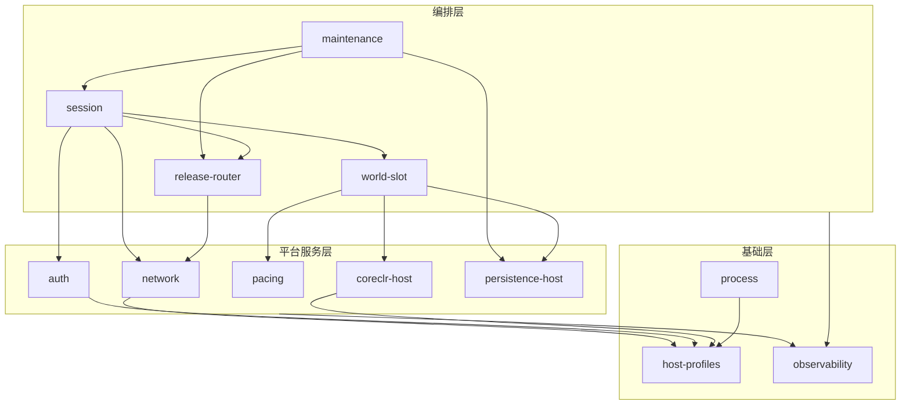

# LumioServer 系统架构（模块总入口）

> **架构基线**：`LGE-V1.0-2026-08-27`
> **唯一架构源**：`LumioGameEngineArchitecture`（本仓只保存只读镜像 [docs/architecture/LumioGameEngine_Architecture_v1.0.md](../docs/architecture/LumioGameEngine_Architecture_v1.0.md)）
> **本文定位**：LumioServer 源码模块骨架的架构总入口。公共语义一律引用架构源，本文只定义本仓内部的模块划分、依赖方向、线程/队列拓扑和运维流程编排；与架构源冲突时以架构源为准。

## 1. 设计目标、范围与非目标

### 1.1 设计目标

- 把根 [README.md](../README.md) 声明的 Server 职责（进程、连接、Release 路由、WorldSlot、Host Pacing、CoreCLR Hosting、滚动更新、强制维护）拆分为**状态所有权唯一、生命周期清晰、依赖单向、故障边界明确**的源码模块。
- 让开发者在不阅读未来实现的情况下，仅凭各模块 `README.md` 就能回答：这个模块负责什么、不负责什么、拥有哪些状态、跑在哪个线程、失败时如何分类与恢复。
- 为 Foundation 阶段的 Cargo 工程落地提供一对一的 crate/模块映射，避免实现期再争论边界。

### 1.2 范围

- 本目录覆盖 LumioServer 全部一等源码模块；每个模块一个目录，目录内 `README.md` 是该模块的边界契约。
- 本阶段只有目录与 Markdown 文档，不包含 Cargo 工程、Rust 源码、配置文件、测试代码或 CI。

### 1.3 非目标

- 不定义 ECS、Voxel、GAS、Logical Tick Phase、Replication Mapping、Client Prediction 或任何 Gameplay 语义（分别归 `LumioGameRuntime`、`LumioVoxelEngine`、`LumioGame`，见架构源 §2.1）。
- 不重新定义公共 Envelope、ReleaseManifest/Catalog、MaintenanceCommand、HostCapability、LoggingEvent、FailureBundle、SnapshotHeader、错误码或任何 Schema——它们只在架构源维护（见 §10）。
- 不冻结未批准的实现选型：Transport/Codec/压缩栈、日志外部 Sink、存储后端、WAL 持久化策略等一律以决策门表示（见 §11）。

## 2. 系统上下文与仓库边界

LumioServer 是七仓库体系中的 Rust Dedicated Server Host 与网络基础设施（架构源 §2.1）：

- **本仓拥有**：进程、监听 Endpoint、认证、Connection、Session Admission、Release Pool 路由、WorldSlot、Host Wall Clock/pacing、CoreCLR Hosting、滚动更新、维护生命周期与资源配额。
- **本仓不拥有**：ECS Storage、Logical Phase 语义、Gameplay 规则、Voxel 内部状态、Client ReplicaWorld。Server 只保存句柄、Context、Snapshot 元数据和编排状态。
- **编译依赖**（架构源 §2.2）：`LumioServer -> LumioGameRuntime + LumioCoreEngine Package`；Gameplay Assembly、Config/Content 与生成契约以版本化构建产物输入，不形成对 Host 源码的反向依赖。
- **运行时加载**：`ReleaseCatalog -> Server Host -> one CoreEngine package per process -> stable Runtime -> ServerGameplay Assembly -> Config/Content/Snapshot`。

四条全局硬约束（各模块 README 不得违背）：

1. Host 只负责进程、时钟、连接和编排；权威状态变化只能在 Runtime Tick Barrier 应用。
2. 网络线程不得直接调用 Gameplay；网络/IO/Native Completion 回调只能写入有界队列。
3. LocalEmbedded 可以绕过 Socket/TLS/OS 网络栈，但不得绕过 Schema、Codec、Envelope、权限、大小限制和有界队列。
4. 每个进程默认只加载一个 GameRelease、一个 CoreEngine 包、一个 CoreCLR（决策门 D-001 的临时默认值即本设计）。

## 3. 模块地图与依赖方向

### 3.1 模块地图

| 模块 | 一句话职责 | 层 | 首批状态 |
| --- | --- | --- | --- |
| [process](process/README.md) | 进程入口、启动/关闭编排、信号、配置快照、进程级 Watchdog 与崩溃处置 | 基础 | P0 |
| [host-profiles](host-profiles/README.md) | Host Capability/Preset 声明与匹配、LocalEmbedded 保真约束、Fault Decorator 配置、测试 Host 组装矩阵 | 基础 | P1 |
| [observability](observability/README.md) | 异步日志 Sink、Audit 管道、Metrics/Trace、Failure Bundle 组装、应急同步落盘与脱敏 | 基础 | P1 |
| [network](network/README.md) | Reactor、Envelope 结构校验、可靠性/分片/Ack、限流背压、Ingress/Egress 有界队列、传输 Adapter | 平台服务 | P0 |
| [auth](auth/README.md) | 认证、票据校验、防重放、连接级权限语义、认证审计事件源 | 平台服务 | P0 |
| [pacing](pacing/README.md) | Host Wall Clock、Tick 触发与 Deadline、暂停/恢复、输入批次切割、配置快照 Tick 边界切换 | 平台服务 | P0 |
| [coreclr-host](coreclr-host/README.md) | CoreCLR/稳定 Runtime 装载、Gameplay ALC 生命周期、异常到稳定错误码转换、故障分级 | 平台服务 | P0 |
| [persistence-host](persistence-host/README.md) | Snapshot/WAL/TxnJournal/CommandLog 落盘编排、Checkpoint、恢复编排、存储 Adapter | 平台服务 | P1 |
| [session](session/README.md) | Session Admission、Release 固定、重连窗口、ReplicationContext 句柄、Session 到 WorldSlot 路由 | 编排 | P0 |
| [release-router](release-router/README.md) | ReleaseCatalog 消费、Manifest/签名/Capability 校验、Pool 状态机、健康检查、路由决策 | 编排 | P1 |
| [world-slot](world-slot/README.md) | WorldSlotHost 状态机、资源配额、Simulation Owner Thread、Runtime/Voxel 句柄、Slot Watchdog | 编排 | P0 |
| [maintenance](maintenance/README.md) | 滚动更新、Drain、Graceful/Forced 维护、MaintenanceKick、Rollback 编排 | 编排 | P1 |

### 3.2 依赖方向

依赖只能从编排层指向平台服务层、从上向下指向基础层；同层依赖必须在本文登记；禁止反向依赖与循环依赖。



补充约定：

- `process` 是**组装根**：唯一允许知道全部模块并按 §6.1 顺序初始化/析构它们的模块；图中未画出它对各模块的组装边，以免掩盖运行期依赖。
- `observability` 与 `host-profiles` 是**全员只读依赖**：任何模块可以发事件/查能力，二者不得回调任何上层模块。
- `network` 永不依赖 `session`、`world-slot` 或任何 Gameplay 入口；它只把校验通过的消息写入有界 Ingress 队列。
- 连接级权限检查的**语义归 `auth`**，**执行点在 `network`**：`session` 在 Admission 时从 `auth` 取得权限上下文并绑定到连接注册表，`network` 解码后按该上下文过滤，不产生 `network -> auth` 调用边。
- `maintenance` 对 `world-slot` 的 Quiesce/Drain 指令经由 `session`（关闭接入）与 `release-router`（Pool 状态）间接生效；对 Slot 的直接停机动作由 `process` 编排执行，避免 `maintenance -> world-slot` 双向边。

### 3.3 关键调用链

1. **启动**：`process` → `host-profiles`（Preset/Capability 解析）→ `release-router`（Manifest/签名/ABI/Capability 校验）→ `coreclr-host`（CoreCLR + 稳定 Runtime + Gameplay ALC）→ `world-slot`（`Allocated → Bootstrapping → NativeReady → ManagedReady`）→ `network`（监听）→ `session`（开放 Admission）。
2. **连接接入**：`network`（Envelope 长度/版本/完整性校验）→ `session`（Admission 管道开始）→ `auth`（认证/防重放/权限上下文）→ `release-router`（`ExactRelease` 匹配）→ `session`（固定 `productId + gameReleaseId`、绑定 WorldSlot、创建 ReplicationContext 句柄）→ FullSnapshot/BaselineAck 序列（语义归 Runtime，传输经 `network`）。
3. **Tick**：`pacing`（Wall Clock 触发、Deadline）→ `world-slot` 的 Simulation Owner Thread → 从 `network` Ingress 有界队列取批 → 经 `coreclr-host` 稳定入口调用 Runtime Tick（13 相语义在 Runtime 内部）→ `EgressPublish` 结果 → `network` Egress 有界队列 → 发送。
4. **维护/滚动更新**：`maintenance`（命令 scope 校验）→ `release-router`（Pool 状态迁移）→ `session`（停新接入、广播原因/deadline）→ Slot Quiesce/Drain → `persistence-host`（Snapshot/WAL/Audit 落盘）→ `MaintenanceKick` 经 `network` 广播 → 关旧起新。
5. **崩溃恢复**：`process`（崩溃证据、Failure Bundle 触发）→ `persistence-host`（最近有效 Checkpoint + 只重放带提交标记的记录）→ `world-slot` 重建 → `session` 重连窗口恢复。
6. **关闭**：`process`（信号）→ `session`（关闭 Admission）→ Drain → `persistence-host`（落盘）→ `pacing`（停止 Tick）→ `coreclr-host`（卸载 ALC）→ `observability`（Flush）→ 按退出码退出（详见 §6.6）。

## 4. 进程、线程、有界队列与 Tick Pacing

### 4.1 线程拓扑与所有权

```text
Main / Signal Thread                 — process 拥有
Network Reactor Thread(s)            — network 拥有（数量为部署配置）
  -> bounded per-session Ingress     — network 拥有队列与满载策略执行
  -> Simulation Owner Thread         — world-slot 拥有（每 active WorldSlot 一个）
  -> bounded Native Job Pool /
     Completion Queue                — CoreEngine/Runtime 侧拥有，Host 只见句柄
  -> IO / Persistence Worker(s)      — persistence-host 拥有
  -> bounded Egress Queue            — network 拥有
  -> Network Send                    — network 拥有
Async Log Sink Thread(s)             — observability 拥有
```

- Simulation Owner Thread 是**唯一** Managed Tick 入口（架构源 §8.1）；Native Worker 不回调 Hot Gameplay；Native Completion 只在 Tick Barrier 应用。
- 每个队列必须声明容量、优先级、满载动作和 Metrics；禁止无界增长（架构源 §4.3）。容量数值属决策门 SRV-D-001/002/008（见 §11.2）。
- 可靠积压超阈值时先降级后断开；Unreliable 满载丢弃并计数。

### 4.2 Tick Pacing

- `pacing` 拥有 Host Wall Clock，决定**何时**进入一个逻辑 Tick；Runtime 决定 Tick **内部**语义（13 相，`IngressCapture` 到 `EgressPublish`，架构源 §4.1）。Runtime 从不直接读 Wall Clock（架构源 ADR-001）。
- 迟到输入的 `ArrivalClass` 分类语义归 Runtime；`pacing` 只提供到达时间戳与批次切割。
- 配置快照只在 Tick 边界原子切换（架构源 §11.3）。

## 5. 状态所有权与故障域

### 5.1 状态所有权

| 状态 | 所有者模块 | 说明 |
| --- | --- | --- |
| 进程生命周期、配置快照、退出码 | process | 配置格式契约归 Runtime（架构源 ADR-010），本仓只做装载与切换编排 |
| Capability/Preset 声明 | host-profiles | Schema 归架构源 `schemas/host-capability.schema.json` |
| Connection、Ingress/Egress 队列、限流/背压计数 | network | 不含认证身份与 Session 语义 |
| 身份、票据、防重放窗口、权限上下文 | auth | Secret 材料与普通配置分离 |
| Session 注册表、Release 固定、重连窗口、ReplicationContext 句柄 | session | Client ReplicaWorld 不是 Server 物理对象 |
| ReleaseCatalog 副本、Pool 状态、路由表、健康状态 | release-router | Catalog/Manifest Schema 归架构源 |
| WorldSlot 状态机、资源配额、Runtime/Voxel 句柄 | world-slot | GameWorld/VoxelWorld 内部状态归 Runtime/VoxelEngine |
| Wall Clock、TickRate、Deadline、暂停位 | pacing | Logical `TickId` 归 Runtime |
| CoreCLR、Runtime 装载态、Gameplay ALC 状态 | coreclr-host | ALC 内 Managed 对象归 Runtime |
| Snapshot 元数据、WAL/TxnJournal/CommandLog 落盘态、Checkpoint 指针 | persistence-host | Canonical 字节与格式契约归 Runtime |
| 维护命令状态、滚动更新进度 | maintenance | 命令 Schema 归架构源 |
| 日志/Audit/Metrics/Trace 队列、Failure Bundle 装配 | observability | Event Schema 归架构源 |

### 5.2 故障域（从小到大）

| 故障域 | 触发 | 处置 | 责任模块 |
| --- | --- | --- | --- |
| 连接级 | 畸形/超限 Envelope、认证失败、限流超限 | 拒绝或断开该连接，返回稳定错误，不影响其他连接 | network、auth |
| Session 级 | 可捕获 Gameplay Exception、重连窗口超时 | 隔离为 Session Fault，踢出该 Session，写 Audit | session、coreclr-host |
| Slot 级 | Slot Watchdog 判定失活、Slot 资源配额超限 | Slot 进入 `Faulted`；V1 单 active Slot，通常升级为进程级 | world-slot |
| 进程级 | OOM、Stack Overflow、CoreCLR 崩溃、Native UB | 进程终止；写 Failure Bundle；从最近有效 Snapshot + WAL 恢复 | process、persistence-host |
| Pool 级 | 健康检查失败、维护命令、Rollback | 以 `ProductId + GameReleaseId + ReleasePoolId` 为界隔离处置 | release-router、maintenance |

可恢复 Session Fault 与进程级崩溃**不得伪装成同类错误**（本仓 [repository-architecture.md](../.spec/knowledge/standards/repository-architecture.md)）。

## 6. 核心流程

### 6.1 启动

1. `process` 装载并编译配置为不可变快照；初始化 `observability`（最早，保证后续步骤可记录）。
2. `host-profiles` 解析 Preset 与 Provided/Required Capability；不匹配在激活前以稳定原因失败。
3. `release-router` 装载 ReleaseCatalog，校验目标 ReleaseManifest 的 Hash、签名、SBOM、ABI 与 Capability；任一失败阻止进入 Serving。
4. `coreclr-host` 加载唯一 CoreEngine 包、启动唯一 CoreCLR、装载稳定 Runtime 与 ServerGameplay Collectible ALC；ABI/版本/Capability 不匹配在 World 创建前失败。
5. `world-slot` 按资源预算分配 WorldSlot，经 Runtime 创建 GameWorld、经 VoxelEngine 创建 VoxelWorld，进入 `ManagedReady`。
6. `network` 绑定监听 Endpoint；`pacing` 启动 Wall Clock；`session` 开放 Admission；Pool 状态进入 `Serving`。
7. 任一步失败进入明确 `Faulted`，不留半初始化对象（架构源 §3.3）。

### 6.2 连接认证与 Session Admission

1. `network` 接受连接，对首包做长度/版本/完整性/大小上限校验；畸形或超限在分配前拒绝。
2. `session` 启动 Admission 管道：调用 `auth` 完成身份认证、票据校验与防重放检查；失败计入可拒绝错误并写 Audit。
3. `session` 向 `release-router` 请求 `ExactRelease` 匹配（决策门 D-007 默认拒绝 N/N-1）；不匹配返回稳定错误与强制更新指引。
4. 通过后 `session` 固定该 Session 的 `productId + gameReleaseId`，绑定 WorldSlot，创建 Connection/ReplicationContext 句柄，并把 `auth` 下发的权限上下文绑定到连接注册表。
5. Runtime 侧开始 `FullSnapshot -> BaselineAck -> Delta` 序列；Transport ACK 与 Baseline ACK 分离（架构源 §7.1）。

### 6.3 运行（Tick 主循环）

1. `pacing` 按 TickRate 触发；`world-slot` 的 Simulation Owner Thread 从 Ingress 队列取批。
2. 经 `coreclr-host` 稳定入口调用 Runtime 逻辑 Tick；权威状态变化只在 Runtime Tick Barrier 应用。
3. `EgressPublish` 产物进入 Egress 队列，由 `network` 发送；Tick 超预算由 `pacing` 归因上报，处置遵循 Host 策略。

### 6.4 维护与滚动更新

- 滚动更新状态机（公共契约）：`Published -> Verified -> Warmup -> Serving`；旧 Pool `Draining -> Empty -> Retired`；任一阶段可 `Rollback / Faulted`。
- 维护命令必须携带 `productId + gameReleaseId + releasePoolId` 作用域；缺 scope 的命令直接拒绝（对应架构源反例 Fixture `fixtures/invalid/maintenance-missing-scope.json`）。
- `Graceful`：停新接入 → 广播原因与 deadline → 排空事务 → Snapshot/WAL/Audit 落盘 → deadline 到达后对剩余连接广播 `MaintenanceKick` 并断开。
- `Forced`：立即停止新输入与 Tick 提交 → 尽最大努力写 WAL/Failure Bundle → 广播 `MaintenanceKick` 并断开全部目标 Pool 连接；未提交命令不得假定生效。
- 两种模式都必须确保没有连接留在旧实例，再关旧起新；断开、失败与恢复动作写入 Audit 与 Failure Bundle。

### 6.5 崩溃恢复

1. `process` 重启后检测崩溃证据（crash marker、未完成的 `CommitIntent`）。
2. `persistence-host` 定位最近有效 Checkpoint，校验 Magic/SchemaVersion/Hash/Checksum；损坏数据不得激活且不覆盖旧数据。
3. 只重放带 WAL 提交标记的记录；`Indeterminate` 事务按 TxnJournal 标记解决（架构源 §6.2）。
4. `world-slot` 重建 Slot 与 World；`session` 在重连窗口内恢复会话，窗口外从 Handshake/FullSnapshot 重新开始。

### 6.6 关闭

1. `process` 收到 SIGTERM/SIGINT，进入 Draining：`session` 关闭 Admission。
2. 排空或显式中止在途事务；固定 SnapshotCut；`persistence-host` 完成落盘。
3. `pacing` 停止 Tick；`world-slot` 按销毁顺序释放（停止新输入 → 完成/中止事务 → 导出证据 → 卸载 Gameplay Scope → 释放 Voxel → 释放 ECS → 关闭 Host）。
4. `coreclr-host` 卸载 ALC 并验证 Root；`observability` Flush 全部持久队列；`process` 以分类退出码退出。

## 7. Release Pool、WorldSlot 与 CoreCLR 的关系

```text
ReleasePool（跨进程的路由/维护单位，状态见 §6.4）
  └─ Server Process（1 个进程 = Pool 的 1 个成员）
       ├─ 1 个 CoreEngine 包 + 1 个 CoreCLR + 1 个稳定 Runtime + 1 个 GameRelease   ← D-001 默认
       └─ WorldSlotHost
            └─ V1 默认 1 个 active WorldSlot（多 Slot 接口保留，属共享故障域）
                 └─ ServerSimulationSession（Runtime 拥有）
                      ├─ GameWorld / VoxelWorld（权威，Runtime/VoxelEngine 拥有）
                      └─ per-client ReplicationContext（Server 只保存句柄）
```

- `A 1.1` 与 `BOE 2.1` 并行服务 = 两个不同 Pool 的不同进程；一个进程/Runtime 实例只加载一个 Release。
- 同一 Session 建立后精确固定 Release；V1 不接受跨 Release 连接，也不要求在线 Session 无感跨 Release 迁移（决策门 D-002/D-007）。
- CoreCLR 崩溃是进程级故障 → 波及该进程的全部 Slot/Session；这是"V1 单 active Slot"建议的直接原因。

## 8. Host Profile

Server 相关 Preset（公共 Schema：架构源 `schemas/host-capability.schema.json`；命名 Preset 见架构源 §10）：

| Preset | 进程拓扑 | Server 侧含义 |
| --- | --- | --- |
| `RemoteDS` | 独立 DS 进程 + 远端 Client | 生产形态；完整 Socket/TLS 栈（栈选型属 D-004） |
| `LocalSplitProcess` | 同机两进程 | 端口/进程隔离保真验证；网络栈同 RemoteDS |
| `LocalEmbedded` | 单进程双角色（Server Role + Client Role 两棵树） | 绕过 Socket/TLS/OS 网络栈，但**同 Envelope/Codec/权限/大小限制/有界队列/Tick 交付**（架构源 ADR-009） |
| `PureHeadless` / `NativeHeadless` | 无网络测试 Host | 主要由 Runtime 消费；Server 侧提供 DS 启停与 Bot Endpoint 测试面 |

- Room Mode：`PublicDedicatedServer`、`PlayerHostedDedicatedServer`（始终是独立 DS 进程）、`LocalhostDedicatedServer`、`LocalEmbedded` Server Role；Listen Server 不是 V1 目标。
- Gameplay 只读取 Role、Capability 和 Port，不读取 `IsOffline`/`IsLocal` 之类布尔值（架构源 ADR-014）。
- Fault Decorator（延迟、抖动、丢包、乱序、重复、断线、重连、QueueFull）按 Host Profile 声明、带确定性 Seed，并记录进 Replay/Failure Bundle 元数据。

## 9. 安全、持久化、可观测性与资源治理

- **安全**：认证、防重放、限流、背压和审计不能由本地快捷路径跳过；Secret 与普通配表分离；生产配置只能通过带 Hash/签名的版本显式切换；密钥不入库、不进日志。认证语义见 [auth](auth/README.md)。
- **持久化**：版本化 Snapshot + WAL/Command Log；本地文件/目录是第一阶段权威存储，对象存储/数据库经 Adapter 预留；写入使用临时文件、校验、fsync、原子替换与保留策略；权威确认前按部署策略保证可恢复（决策门 D-005）。编排见 [persistence-host](persistence-host/README.md)。
- **可观测性**：Diagnostic 可采样丢弃；Audit/TxnJournal/CommandLog 走独立持久队列，满载停止接入或进维护，不得静默丢失；Error/Fatal 同步应急落盘；全部事件携带公共 correlation 字段。管道见 [observability](observability/README.md)。
- **资源治理**：每个队列、Session、Slot、Pool 都有声明的预算与 Metrics；Watchdog 与维护超时必须有故障测试；OOM/队列溢出/丢失持久日志/Tick 超时都是命名失败（架构源 ADR-016）。

## 10. 公共契约清单与架构来源

以下契约**只在架构源维护**，本仓只消费；引用时字段拼写以 Schema 为准（camelCase，如 `protocolVersion`、`gameReleaseId`），根 README 散文中的 PascalCase 写法是叙述惯例而非权威拼写。

| 契约 | 架构源位置（`LumioGameEngineArchitecture` 仓内） | 正/反 Fixture | 主要消费模块 |
| --- | --- | --- | --- |
| Wire Envelope | `schemas/replication-envelope.schema.json` | `replication-full-snapshot.json`、`replication-delta.json` / `replication-gap-without-resync.json` | network、session |
| ReleaseManifest | `schemas/release-manifest.schema.json` | `release-manifest-a-1.1.json`、`release-manifest-boe-2.1.json` / `release-manifest-mismatch.json` | release-router |
| ReleaseCatalog | `schemas/release-catalog.schema.json` | `release-catalog.json` / `release-catalog-duplicate-route.json` | release-router |
| MaintenanceCommand | `schemas/maintenance-command.schema.json` | `maintenance-graceful.json`、`maintenance-forced.json` / `maintenance-missing-scope.json` | maintenance |
| HostCapability | `schemas/host-capability.schema.json` | `host-capability.json` / `host-capability-missing-role.json` | host-profiles |
| LoggingEvent | `schemas/logging-event.schema.json` | `logging-audit.json` / `logging-audit-missing-correlation.json` | observability |
| FailureBundle | `schemas/failure-bundle.schema.json` | `failure-bundle.json` / `failure-bundle-bad-hash.json` | observability、process |
| SnapshotHeader | `schemas/snapshot-header.schema.json` | `snapshot-active.json` / `snapshot-length-mismatch.json` | persistence-host |
| SessionRevisionVector | `schemas/common.schema.json`（`sessionRevisionVector`） | `session-revision-vector.json` / `session-revision-negative.json` | session、persistence-host |
| CrossWorldTxn | `schemas/cross-world-txn.schema.json` | `cross-world-txn-committed.json`、`cross-world-txn-aborted.json` / `cross-world-txn-partial-commit.json` | persistence-host（仅 durability） |
| WorldSlotHost/SimulationSession 状态机 | `docs/architecture/LumioGameEngine_Architecture_v1.0.md` §3.2 | 由 Host 测试覆盖每个迁移 | world-slot、session |
| Pool 滚动更新状态机 | 同上 §13.2 与 `docs/adr/ADR-012-release-update-maintenance.md` | 见 ReleaseCatalog Fixture | release-router、maintenance |
| 13 相 Tick、ProcessorDescriptor | 同上 §4 与 `docs/adr/ADR-002-tick-determinism.md` | `processor-place-voxel.json` / `processor-read-write-conflict.json` | pacing、world-slot（只消费入口） |
| NativeManagedAbiV1 | `schemas/native-managed-abi.schema.json` 与 `docs/adr/ADR-006-native-managed-abi.md` | `native-managed-abi.json` / `native-managed-abi-pointer-width.json` | coreclr-host |

### 10.1 命名与来源差异说明

本次模块划分对既有文档做了以下裁决（依据与理由记录于此，供后续审查）：

1. **`auth` 独立成模块**：架构源 §16 的 Server 首批子模块含 `auth`；根 README 旧表曾把认证并入 `network` 行。认证是安全红线面，拥有独立状态（防重放窗口、票据）与独立故障域（认证失败是可拒绝错误，传输失败是可重试错误），故独立。
2. **`headless` 更名重构为 `host-profiles`**：Capability 声明、Preset 组装、Fault Decorator 与 LocalEmbedded 保真约束是同一所有权（架构源 ADR-009/014），测试 Host 入口只是其组装产物。
3. **`session`、`coreclr-host`、`observability` 是本仓对架构源 §16 粗粒度清单的细化**：根 README 职责章节明确这些能力，细化不改变任何公共契约。
4. **Audit 管道归 `observability`，恢复输入（TxnJournal/CommandLog/Snapshot/WAL）归 `persistence-host`**：架构源 ADR-011 将三者并列为持久队列，但 Audit 是合规证据而非恢复输入，durability 语义不同。
5. **跨仓引用规则**：引用架构源内容一律写"仓库名 + 仓内路径"的代码格式文本，不做文件系统相对链接（克隆者不可达）；本仓内部引用使用相对 Markdown 链接。

## 11. 决策门与版本演进规则

### 11.1 公共决策门（架构源 `docs/architecture/DECISIONS_PENDING.md`，D-001 到 D-008）

实现只能按临时默认值推进，测量结论标注 provisional；确认记录须含日期、负责人、选定值、被否方案与受影响 ADR/Manifest。

| ID | 问题 | 临时默认值 | 落点模块 |
| --- | --- | --- | --- |
| D-001 | 一进程一 Release 还是多 Release | 每进程一个 `gameReleaseId`；多产品/版本用多 Pool 进程 | coreclr-host、release-router |
| D-002 | 滚动更新 drain 到什么程度 | Service-level drain；在线 Session 迁移需新 ADR 与协议 epoch | maintenance |
| D-003 | 维护默认模式 | 计划性工作用 `Graceful`；`Forced` 仅紧急/安全事件 | maintenance |
| D-004 | Transport/Codec/压缩 OSS 栈 | 不冻结供应商；成熟 OSS 置于 Adapter 后评估 | network |
| D-005 | Snapshot/WAL 持久与保留强度 | DS 权威确认前可恢复；group-commit/sync 待测量 | persistence-host |
| D-006 | MobileLocal 预算与 HybridCLR 政策 | 先做测量 spike；Server HybridCLR 非 V1 前置 | host-profiles |
| D-007 | 是否接受 N/N-1 兼容 | 否；精确 `productId + gameReleaseId` 匹配 + 强制更新 | release-router、session |
| D-008 | 外部日志 Sink 与保留/PII 政策 | 先文件 + 控制台 Adapter；外部 Sink 属部署选择 | observability |

### 11.2 Server 内部决策门（SRV-D，本仓新设）

以下参数属于本仓可细化设计，但数值**未经测量**，一律为临时默认值；批准条件达成前不得写死进公共契约或部署基线。确认后记入 [.spec/decisions/](../.spec/decisions/README.md) 的 ADR。

| ID | 问题 | 临时默认值 | 落点模块 | 批准条件 |
| --- | --- | --- | --- | --- |
| SRV-D-001 | per-session Ingress 队列容量与满载动作参数 | 每 Session 256 条 / 256 KiB；Unreliable 满载丢弃并计数，Reliable 满载断开 | network | Foundation 阶段按架构源 ADR-016 Workload 测量后确认 |
| SRV-D-002 | Egress 队列容量与可靠积压降级阈值 | 每 Session 512 条 / 1 MiB；可靠积压超阈值先降速后断开 | network | 同 SRV-D-001 |
| SRV-D-003 | Slot Watchdog 判定阈值 | 连续 3 个 Tick Deadline 超限或 5 秒无心跳判定 Slot 失活 | world-slot | Foundation 阶段测量 Tick p99 后确认 |
| SRV-D-004 | 重连窗口时长与保留资源上限 | 120 秒窗口；窗口内保留 Session/ReplicationContext 元数据 | session | Vertical Slice 阶段结合真实断线数据确认 |
| SRV-D-005 | 认证凭据格式与验证机制 | 由 Release 签名密钥体系派生的签名票据；防重放窗口 30 秒 + 单调 nonce | auth | 安全评审通过并记入 ADR |
| SRV-D-006 | 连接限流与背压默认参数 | 每连接 64 msg/s、突发 128；超限先延迟后断开 | network | 按架构源 ADR-016 基准测量确认 |
| SRV-D-007 | Pool 健康检查周期与阈值 | 5 秒周期；连续 3 次失败标记 unhealthy | release-router | Production Hardening 阶段确认 |
| SRV-D-008 | Diagnostic 日志队列容量与采样策略 | 每 Producer 8192 条有界队列；满载按级别丢弃并计数 | observability | 日志 Soak 测试后确认 |
| SRV-D-009 | Checkpoint 周期与保留数量 | 每 5 分钟或每 6000 Tick 取先到者；保留最近 3 个有效 Checkpoint | persistence-host | 随 D-005 测量一并确认 |
| SRV-D-010 | Graceful 维护默认 deadline | 15 分钟 | maintenance | 运维手册评审确认 |

### 11.3 版本演进规则

- **公共语义变更**（状态、字段、错误、时序、ID、版本、依赖图）：只能在架构源完成"新增/更新 ADR → 更新 Schema/Fixture → 生成新 BaselineId → 同步七仓镜像"，本仓随新 Baseline 更新镜像与受影响模块 README。
- **本仓内部设计变更**（模块边界、队列拓扑、SRV-D 确认）：记入 [.spec/decisions/](../.spec/decisions/README.md)（ADR 不改写、只新增取代），并同步受影响模块 README 与本文。
- **模块 README 的地位**：描述设计现状的边界契约，不保留决策过程；决策历史一律在 ADR。
- 首次引入 Rust 代码时必须先固定 toolchain、`rustfmt`、`clippy` 与验证命令，并更新 [.spec/knowledge/standards/code-style.md](../.spec/knowledge/standards/code-style.md)（该文件已有此要求）。
