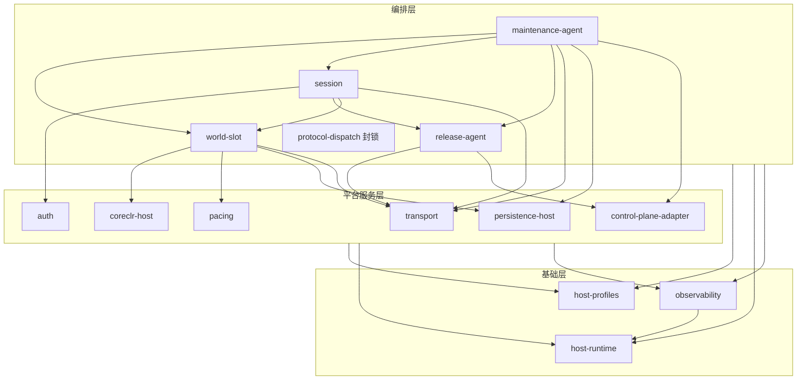
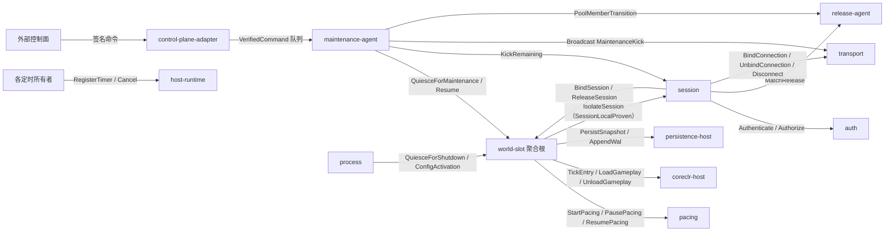
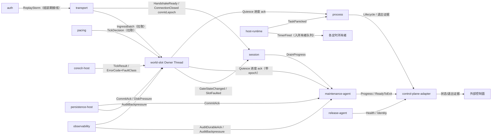

# LumioServer 系统架构（模块总入口）

> **架构基线**：`LGE-V1.4-2026-08-27`
> **唯一架构源**：`LumioGameEngineArchitecture` 固定提交 `d3252a8886b4bfd56fbb08490c3db0e6fc8c9550`（本仓只保存只读镜像 [docs/architecture/LumioGameEngine_Architecture_v1.4.md](../docs/architecture/LumioGameEngine_Architecture_v1.4.md)）
> **本文定位**：LumioServer 源码模块骨架的架构总入口。公共语义一律引用架构源，本文只定义本仓内部的模块划分、依赖方向、线程/队列拓扑和运维流程编排；与架构源冲突时以架构源为准。

## 1. 设计目标、范围与非目标

### 1.1 设计目标

- 把根 [README.md](../README.md) 声明的 Server 职责（进程、连接、Release 路由、WorldSlot、Host Pacing、CoreCLR Hosting、滚动更新、强制维护）拆分为**状态所有权唯一、生命周期清晰、依赖单向、故障边界明确**的源码模块。
- 让开发者在不阅读未来实现的情况下，仅凭各模块 `README.md` 就能回答：这个模块负责什么、不负责什么、拥有哪些状态、跑在哪个线程、失败时如何分类与恢复。
- 为 Foundation 阶段的 Cargo 工程落地提供一对一的 crate/模块映射，避免实现期再争论边界。

### 1.2 范围

- 本目录覆盖 LumioServer 全部一等源码模块；每个模块一个目录，目录内 `README.md` 是该模块的边界契约。
- 本阶段只有目录与 Markdown 文档，不包含 Cargo 工程、Rust 源码、配置文件、测试代码或 CI。

### 1.3 非目标

- 不定义 ECS、Voxel、GAS、Logical Tick Phase、Replication Mapping、Client Prediction 或任何 Gameplay 语义（分别归 `LumioGameRuntime`、`LumioVoxelEngine`、`LumioGame`，见架构源 §2.1）。
- 不重新定义公共 Envelope、ReleaseManifest/Catalog、MaintenanceCommand、HostCapability、LoggingEvent、FailureBundle、SnapshotHeader、错误码或任何 Schema——它们只在架构源维护（见 §10）。
- 不冻结未批准的实现选型：Transport/Codec/压缩栈、日志外部 Sink、存储后端、WAL 持久化策略、控制面通道、认证凭据格式等一律以决策门表示（见 §11）。

## 2. 系统上下文与仓库边界

LumioServer 是七仓库体系中的 Rust Dedicated Server Host 与网络基础设施（架构源 §2.1）：

- **本仓拥有**：进程、监听 Endpoint、认证、Connection、Session Admission、Release 身份代理、WorldSlot 聚合根、Host Wall Clock/pacing、CoreCLR Hosting、维护代理执行与资源配额。
- **本仓不拥有**：ECS Storage、Logical Phase 语义、Gameplay 规则、Voxel 内部状态、Client ReplicaWorld，以及**集群期望状态**（哪些 Pool 存在、流量分配、实例替换时机——归外部控制面，架构源 ADR-012）。Server 只保存句柄、Context、Snapshot 元数据和编排状态。
- **编译依赖**：`LumioServer -> LumioEngineSDK`；Gameplay Assembly、Config/Content 由 `LumioGame` 组合后输入，不形成对 SDK provider 源码的反向依赖。
- **运行时加载**：`ReleaseCatalog -> Server Host -> one CoreEngine package per process -> stable Runtime -> ServerGameplay Assembly -> Config/Content/Snapshot`。

五条全局硬约束（各模块 README 不得违背）：

1. Host 只负责进程、时钟、连接和编排；权威状态变化只能在 Runtime Tick Barrier 应用。
2. 网络线程不得直接调用 Gameplay；网络/IO/Native Completion 回调只能写入有界队列。
3. LocalEmbedded 可以绕过 Socket/TLS/OS 网络栈，但不得绕过 Schema、Codec、Envelope、权限、大小限制和有界队列。
4. 每个进程默认只加载一个 GameRelease、一个 CoreEngine 包、一个 CoreCLR（遵循决策门 D-001 的临时默认值，provisional、未冻结；确认或推翻见 §11.1）。
5. Host 聚合迁移只能由 `world-slot` 聚合根发起并携带生命周期 epoch；跨模块协作走**类型化命令 + 显式 ack**，禁止注册任意闭包回调、禁止跨模块共享可变状态（架构源 ADR-001，v1.1）。

## 3. 模块地图与依赖方向

### 3.1 模块地图

| 模块 | 一句话职责 | 层 | 首批状态 |
| --- | --- | --- | --- |
| [process](process/README.md) | 进程入口与组装根：启动/关闭编排、信号、配置快照、进程级 Watchdog、组装期端口接线 | 组装根 | P0 |
| [host-runtime](host-runtime/README.md) | 单调时钟、Timer 服务、取消树、任务监督、有界执行原语 | 基础 | P0 |
| [host-profiles](host-profiles/README.md) | Host Capability/Preset 声明与匹配、LocalEmbedded 保真约束、Fault Decorator 配置、测试 Host 组装矩阵 | 基础 | P1 |
| [observability](observability/README.md) | 异步日志 Sink、Audit 队列与 durable ack、Metrics/Trace、Failure Bundle 装配、应急同步落盘与脱敏 | 基础 | P1 |
| [transport](transport/README.md) | Reactor、Envelope 结构校验、可靠性/分片/Ack、限流背压、Ingress/Egress 有界队列、连接注册表唯一写入者、传输 Adapter | 平台服务 | P0 |
| [auth](auth/README.md) | 认证、票据校验、防重放、连接级授权对象、认证审计事件源 | 平台服务 | P0 |
| [pacing](pacing/README.md) | Tick 触发判定、Deadline 计时、输入批次切割、Tick 边界事实供给（启停受聚合根指挥，无回调注册） | 平台服务 | P0 |
| [coreclr-host](coreclr-host/README.md) | CoreCLR/稳定 Runtime 装载、Gameplay ALC 生命周期、异常到稳定错误码转换、FaultClass 见证转交 | 平台服务 | P0 |
| [persistence-host](persistence-host/README.md) | Snapshot/WAL/TxnJournal/CommandLog 落盘编排与 commit ack、Checkpoint、恢复编排、存储 Adapter | 平台服务 | P1 |
| [control-plane-adapter](control-plane-adapter/README.md) | 外部控制面边界：签名命令验证、fencing、幂等队列、就绪/退出证据上报 | 平台服务 | P1 |
| [session](session/README.md) | Session Admission 管道、Release 固定、重连窗口、ReplicationContext 句柄、ServerConnectionSession 注册表 | 编排 | P0 |
| [release-agent](release-agent/README.md) | 本进程 Release 身份代理：Catalog 消费、Manifest 校验、本 Pool 成员状态、健康检查、ExactRelease 匹配 | 编排 | P1 |
| [world-slot](world-slot/README.md) | Host 侧唯一聚合根：WorldSlotHost 状态机、epoch、Admission Gate、Quiesce 原子序列、故障分级裁决、配额、Simulation Owner Thread | 编排 | P0 |
| [maintenance-agent](maintenance-agent/README.md) | 维护命令进度状态机、滚动更新推进、MaintenanceKick 编排、维护证据（不拥有生命周期） | 编排 | P1 |
| [protocol-dispatch](protocol-dispatch/README.md) | 生成式 RPC/Message 分发边界（公共契约 D-009 冻结前封锁） | 编排 | 封锁 |

### 3.2 三张依赖图

依赖分三张图表达，混用是门审驳回项（架构源 §2.2 同款裁决在仓内的落地）：**源码编译依赖**决定 crate 分层；**运行期命令流**决定谁指挥谁；**运行期事件/ack 流**决定谁向谁报告。命令与事件均为类型化消息，经有界端口传递（§11.2 SRV-D-015）。

#### 3.2.1 源码编译依赖（单向，无环）



- `process` 是**组装根**：唯一允许知道全部模块并按 §6.1 顺序初始化/析构它们、完成端口接线的模块；不入层，不画边以免掩盖运行期依赖。
- `host-runtime` 是编译最底层（含 observability 也依赖它）；`observability` 与 `host-profiles` 是全员只读依赖，不得回调上层。
- 同层依赖仅登记下列五条：`session -> world-slot`、`maintenance-agent -> world-slot`、`maintenance-agent -> session`、`session -> release-agent`、`maintenance-agent -> release-agent`；其余同层依赖是驳回项。
- `protocol-dispatch` 封锁中：目录只允许保留 `README.md`，不得出现 `Cargo.toml`、`src/`、package/target/API，也不得被任何 crate 依赖；三张图均无它的边。

#### 3.2.2 运行期命令流（谁指挥谁；全部为类型化命令，箭头指向执行方）



- 命令必须携带作用域身份（聚合命令带 Slot epoch、连接命令带连接 epoch、维护命令带 `maintenanceId`）；过期身份以 `StaleEpoch`/`FencingTokenStale` 等稳定错误拒绝。
- 图中没有的命令边不存在：例如任何模块直接命令 pacing、任何模块绕过聚合根开关 Gate，都是驳回项。

#### 3.2.3 运行期事件/ack 流（谁向谁报告；箭头指向消费方）



- persistence commit ack 与 Audit durable ack 是**两个独立完成信号**，互不蕴含（架构源 ADR-011）；需要落盘证据的编排步骤必须分别等待。
- 事件是事实通报，不是控制反转：消费方自行决定处置；发布方不等待消费方回执（ack 类事件除外，其超时语义随 SRV-D-015 声明）。

### 3.3 关键调用链

1. **启动**：`process` → `host-runtime`（时钟/监督最早就绪）→ `observability` → `host-profiles`（Preset/Capability 解析）→ `release-agent`（Manifest/签名/ABI/Capability 校验）→ `coreclr-host`（CoreEngine + CoreCLR + 稳定 Runtime + Gameplay ALC）→ `world-slot`（`Allocated → Bootstrapping → NativeReady → ManagedReady`）→ `transport`（监听）→ `world-slot` 开启 Admission Gate → Pool 成员进入 `Serving`。
2. **连接接入**：`transport`（Envelope 长度/版本/完整性校验）→ `session`（读 Gate，Admission 管道开始）→ `auth`（认证/防重放/授权对象）→ `release-agent`（`ExactRelease` 匹配）→ `world-slot`（容量裁决 + `BindSession`）→ `session` 固定 `productId + gameReleaseId`、创建 ReplicationContext 句柄 → `BindConnection` 命令绑定授权对象 → FullSnapshot/BaselineAck 序列（语义归 Runtime，传输经 `transport`）。
3. **Tick**：`pacing`（到期判定）→ `world-slot` 的 Simulation Owner Thread → 从 `transport` Ingress 有界队列取批 → 经 `coreclr-host` 稳定入口调用 Runtime Tick（13 相语义在 Runtime 内部）→ `EgressPublish` 结果 → `transport` Egress 有界队列 → 发送。
4. **维护**：外部控制面签名命令 → `control-plane-adapter`（签名/Schema/fencing/幂等验证）→ `maintenance-agent`（语义校验、`graceDeadlineSeconds` 一次性换算为单调 deadline）→ `world-slot` 聚合根执行 Quiesce 原子序列（关 Gate → Drain → SnapshotCut → 停 pacing，逐步 ack）→ 双 ack 落盘（persistence commit + Audit durable）→ deadline 到 `KickRemaining` → 无存留连接 → `ReadyToExit` 报告 → 进程退出；**目标实例激活发生在本进程之外**（架构源 ADR-012）。
5. **故障分级**：Runtime 见证 `FaultClass` → `coreclr-host` 原样转交 → `world-slot` 裁决：`SessionLocalProven` 隔离单 Session（命令 session 执行）、`SlotStateUnproven`（含缺见证默认）Slot 转 `Faulted` 走恢复、`ProcessFault` 交 `process`。
6. **崩溃恢复**：`process`（崩溃证据、Failure Bundle 触发）→ `persistence-host`（最近有效 Checkpoint + 只重放带提交标记的记录）→ `world-slot` 重建 → `session` 重连窗口恢复。
7. **关闭**：`process`（信号）→ `world-slot` 聚合根 `QuiesceForShutdown`（关 Gate → Drain → 落盘 → 停 pacing，复用维护骨架）→ `coreclr-host` 卸载 ALC → `observability` Flush → `host-runtime` 取消级联并 join → 按退出码退出，证据经 `control-plane-adapter` 报告（详见 §6.6）。

## 4. 进程、线程、有界队列与 Tick Pacing

### 4.1 线程拓扑与所有权

```text
Main / Signal Thread                 — process 拥有
Timer Thread                         — host-runtime 拥有（到期只投递命令，不执行业务）
Network Reactor Thread(s)            — transport 拥有（数量为部署配置；连接终身亲和单一分片）
  -> bounded per-session Ingress     — transport 拥有队列与满载策略执行（严格 SPSC）
  -> Simulation Owner Thread         — world-slot 拥有（每 active WorldSlot 一个）
  -> bounded Native Job Pool /
     Completion Queue                — CoreEngine/Runtime 侧拥有，Host 只见句柄
  -> IO / Persistence Worker(s)      — persistence-host 拥有
  -> bounded Egress Queue            — transport 拥有
  -> Network Send Thread(s)          — transport 拥有
Async Log Sink Thread(s)             — observability 拥有
低频控制上下文（维护/健康/命令验证）    — 各所有者的有界命令收件箱驱动，无常驻专属线程
```

- 全部线程经 `host-runtime` 受监督创建并具名；线程 panic 转 `TaskPanicked` 监督事件，汇入进程级 Watchdog（SRV-D-016）——不存在静默死亡的线程。
- Simulation Owner Thread 是**唯一** Managed Tick 入口（架构源 §8.1）；Native Worker 不回调 Hot Gameplay；Native Completion 只在 Tick Barrier 应用。
- 定时语义全部经 `host-runtime` Timer 以命令投递实现；任何模块不得自建 sleep/轮询线程。

### 4.2 Queue Contract Matrix

每个队列必须声明所有者、生产者/消费者、顺序保证、容量决策门、满载动作与关闭语义；禁止无界增长（架构源 §4.3）。本表是全仓队列的登记处，新增队列必须补行：

| 队列 | 所有者 | 生产者 → 消费者 | 顺序保证 | 容量门 | 满载动作 | 关闭语义 |
| --- | --- | --- | --- | --- | --- | --- |
| per-session Ingress | transport | 亲和 Reactor 分片 → Simulation Owner Thread（SPSC） | 单连接 FIFO | SRV-D-001 | Unreliable 丢弃计数；Reliable 断开连接 | Gate 关闭后停收；Quiesce 按序列处置余量 |
| per-session Egress | transport | Simulation Owner Thread → 发送线程 | 单连接 FIFO | SRV-D-002 | 可靠积压先降速后断开 | 断开前按 SRV-D-002 排空语义 flush |
| Diagnostic 日志 | observability | 任意线程 → Sink 线程 | 每 Producer `eventSeq` | SRV-D-008 | 按级别/类别采样丢弃并计数 | 尽力 Flush |
| Audit durable | observability | 任意线程 → Audit Sink | 每 Producer `eventSeq`；落盘回 durable ack | SRV-D-014 | **不丢**；置背压状态，聚合根关闸/进维护 | 必须 Flush 完才允许退出 |
| WAL / TxnJournal / CommandLog | persistence-host | Simulation Owner Thread → Persistence Worker | 严格追加序；落盘回 commit ack | SRV-D-014 | **不丢**；拒新命令或触发维护 | 必须 Flush 完才允许退出 |
| 维护命令幂等队列 | control-plane-adapter | 已验证命令 → maintenance-agent | FIFO；`maintenanceId` 幂等 | SRV-D-015 | 稳定错误拒绝（控制面重试） | Stopping 期拒新命令 |
| 聚合命令收件箱 | world-slot | maintenance-agent/process/session → 聚合控制上下文 | FIFO；epoch 校验 | SRV-D-015 | 稳定错误拒绝 | Destroyed 后全部拒绝 |
| Session 命令收件箱 | session | transport 事件/world-slot 命令/Timer → session 上下文 | FIFO；连接 epoch 校验 | SRV-D-015 | 稳定错误拒绝 | 终结后拒绝 |
| 连接命令队列 | transport | session/maintenance-agent → Reactor 分片 | 单连接串行 | SRV-D-015 | 稳定错误拒绝 | Closed 后拒绝 |
| Timer 投递 | host-runtime | Timer 线程 → 各所有者收件箱 | 到期序（尽力） | 随目标队列 | 按目标队列满载动作；deadline 类投递失败升级监督事件 | 取消级联后停止 |
| Watchdog 心跳汇聚 | process | 全部具名线程 → 进程级 Watchdog | 无序（最新心跳时间戳） | SRV-D-016 | 覆盖旧心跳（只保留最新） | 进程退出前停止判定 |

### 4.3 Tick Pacing

- `pacing` 决定**何时**进入一个逻辑 Tick；Runtime 决定 Tick **内部**语义（13 相，`IngressCapture` 到 `EgressPublish`，架构源 §4.1）。Runtime 从不直接读 Wall Clock（架构源 ADR-001）；宿主时钟原语归 `host-runtime`，pacing 的启停归 `world-slot` 聚合根。
- 迟到输入的 `ArrivalClass` 分类语义归 Runtime；`pacing` 只提供到达时间戳与批次切割。
- 配置快照只在 Tick 边界原子切换（架构源 §11.3），切换请求走聚合命令。
- **时钟域规则**（架构源 ADR-012）：Logical Tick 域只属于模拟；维护 deadline、重连窗口、健康检查、防重放窗口、Checkpoint 单调间隔全部在 Wall/单调时钟域，经 `host-runtime` 表达；两域换算只发生在 Tick Barrier 上的显式评估点（如 Checkpoint 的 Tick 计数分量）。

## 5. 状态所有权与故障域

### 5.1 状态所有权

| 状态 | 所有者模块 | 说明 |
| --- | --- | --- |
| 进程生命周期、配置快照、退出码、进程级 Watchdog | process | 配置格式契约归 Runtime（架构源 ADR-010），本仓只做装载与切换编排 |
| 单调时钟、Timer 登记表、取消树、受监督任务表 | host-runtime | 业务定时语义归各所有者，本模块只有机械事实 |
| Capability/Preset 声明 | host-profiles | Schema 归架构源 `schemas/host-capability.schema.json` |
| 连接注册表（传输句柄、限流计数、授权对象引用、连接 epoch）、Ingress/Egress 队列、限流/背压计数 | transport | **唯一写入者**；session 经类型化命令请求变更 |
| 身份、票据验证材料、防重放窗口、授权对象的派生 | auth | 授权对象不可变；绑定关系归 session/transport 命令链 |
| ServerConnectionSession 注册表、Release 固定、重连窗口、ReplicationContext 句柄 | session | Host 私有状态；禁止命名/建模为 `ClientReplicaSession`（架构源 ADR-001） |
| 本进程 Release 身份、Catalog 副本、本 Pool 成员状态、健康状态 | release-agent | 集群期望状态归外部控制面；Catalog/Manifest Schema 归架构源 |
| WorldSlotHost 状态机、生命周期 epoch、Host Admission Gate、Quiesce 序列、资源配额、Runtime/Voxel 句柄、FaultClass 裁决 | world-slot | Host 侧唯一聚合根（架构源 ADR-001）；GameWorld/VoxelWorld 内部状态归 Runtime/VoxelEngine |
| TickRate、每 Tick 预算、暂停位、调度时刻 | pacing | Logical `TickId` 归 Runtime；启停只接受聚合命令 |
| CoreCLR、Runtime 装载态、Gameplay ALC 状态 | coreclr-host | ALC 内 Managed 对象归 Runtime；FaultClass 见证归 Runtime、裁决归 world-slot |
| Snapshot 元数据、WAL/TxnJournal/CommandLog 队列与 commit 水位、Checkpoint 指针 | persistence-host | Canonical 字节与格式契约归 Runtime |
| 维护命令进度机、维护证据 | maintenance-agent | 命令 Schema 归架构源；生命周期事实以聚合根 ack 为准 |
| 已验证命令幂等队列、fencing 视图、对外状态报告 | control-plane-adapter | 期望状态归外部控制面 |
| Diagnostic/Audit/Metrics/Trace 队列、durable ack 状态、Failure Bundle 装配 | observability | Event Schema 归架构源；Audit 与恢复输入分权（ADR-011） |

### 5.2 故障域（从小到大）

| 故障域 | 触发 | 处置 | 裁决与执行 |
| --- | --- | --- | --- |
| 连接级 | 畸形/超限 Envelope、认证失败、限流超限、重放 | 拒绝或断开该连接，返回稳定错误，不影响其他连接 | transport 执行；auth 提供裁决语义 |
| Session 级 | Runtime 见证 `SessionLocalProven` 的故障、重连窗口超时 | 隔离终结该 Session，写 Audit，其余不受影响 | Runtime 见证 → coreclr-host 转交 → **world-slot 裁决** → session 执行 |
| Slot 级 | `SlotStateUnproven`（含缺见证默认）、Watchdog 失活、配额超限 | Slot 进入 `Faulted`，从最近有效 Snapshot 恢复；V1 单 active Slot 下通常升级进程级 | world-slot 裁决并执行 |
| 进程级 | `ProcessFault`（OOM、Stack Overflow、CoreCLR 崩溃、Native UB）、线程监督失活 | 进程终止；写 Failure Bundle；从最近有效 Snapshot + WAL 恢复 | process 处置；persistence-host 提供恢复 |
| Pool 级 | 健康检查失败、维护命令、Rollback | 以 `productId + gameReleaseId + releasePoolId` 为界隔离处置；实例替换由外部控制面决定 | 控制面裁决；control-plane-adapter/maintenance-agent/release-agent 执行本进程侧 |

- Host **永不**从"异常是否被捕获"推断故障域（架构源 ADR-006）；缺 `FaultClass` 见证一律按 `SlotStateUnproven` 从严处理。
- 可恢复 Session Fault 与进程级崩溃**不得伪装成同类错误**（本仓 [repository-architecture.md](../.spec/knowledge/standards/repository-architecture.md)）。

## 6. 核心流程

### 6.1 启动

1. `process` 装载并编译配置为不可变快照；初始化 `host-runtime`（最早，时钟与监督先于一切）、随后 `observability`（保证后续步骤可记录）。
2. `host-profiles` 解析 Preset 与 Provided/Required Capability；不匹配在激活前以稳定原因失败。
3. `release-agent` 装载 ReleaseCatalog，校验目标 ReleaseManifest 的 Hash、签名、SBOM、ABI 与 Capability；任一失败阻止进入 Serving。
4. `coreclr-host` 加载唯一 CoreEngine 包、启动唯一 CoreCLR、装载稳定 Runtime 与 ServerGameplay Collectible ALC；ABI/版本/Capability 不匹配在 World 创建前失败。
5. `world-slot` 按资源预算分配 WorldSlot，经 Runtime 创建 GameWorld、经 VoxelEngine 创建 VoxelWorld，进入 `ManagedReady`。
6. `transport` 绑定监听 Endpoint；`world-slot` 启动 pacing 并开启 Admission Gate；本 Pool 成员进入 `Serving`。
7. 任一步失败进入明确 `Faulted`，不留半初始化对象（架构源 §3.3）。

### 6.2 连接认证与 Session Admission

1. `transport` 接受连接，对首包做长度/版本/完整性/大小上限校验；畸形或超限在分配前拒绝。
2. `session` 读取 Admission Gate（关闭即稳定拒绝并附剩余宽限信息），启动 Admission 管道：`auth` 完成身份认证、票据校验与防重放检查；失败计入可拒绝错误并写 Audit（Release 作用域，不伪造 `sessionId`）。
3. `session` 向 `release-agent` 请求 `ExactRelease` 匹配（D-007 默认拒绝 N/N-1）；不匹配返回稳定错误与强制更新指引。
4. 通过后 `session` 经 `world-slot` 容量裁决完成 `BindSession`，固定 `productId + gameReleaseId`，创建 Connection/ReplicationContext 句柄，把 `auth` 派生的不可变授权对象经 `BindConnection` 命令交 `transport` 绑定。
5. Runtime 侧开始 `FullSnapshot -> BaselineAck -> Delta` 序列；Transport ACK 与 Baseline ACK 分离（架构源 §7.1）。

### 6.3 运行（Tick 主循环）

1. `pacing` 按 TickRate 判定到期；`world-slot` 的 Simulation Owner Thread 从 Ingress 队列取批。
2. 经 `coreclr-host` 稳定入口调用 Runtime 逻辑 Tick；权威状态变化只在 Runtime Tick Barrier 应用。
3. `EgressPublish` 产物进入 Egress 队列，由 `transport` 发送；Tick 超预算由 `pacing` 归因上报，连续超限由 world-slot Watchdog 处置。

### 6.4 维护与滚动更新

- 滚动更新状态机（公共契约）：`Published -> Verified -> Warmup -> Serving`；旧 Pool `Draining -> Empty -> Retired`；任一阶段可 `Rollback / Faulted`。新 Pool 阶段发生在**目标实例进程**内；本进程只执行自己的退役侧。
- 命令链：控制面签名命令 → `control-plane-adapter`（签名/Schema/fencing/幂等；`Forced` 带非零宽限拒绝）→ `maintenance-agent`（同 Pool 排他、`graceDeadlineSeconds` 一次性换算单调 deadline）。
- `Graceful`（`graceDeadlineSeconds >= 1`）：聚合根关 Gate → 广播原因与剩余宽限 → Drain → SnapshotCut 落盘，**分别等待** persistence commit ack 与 Audit durable ack → deadline 到 `KickRemaining` 并断开。
- `Forced`（`graceDeadlineSeconds = 0`）：立即 Quiesce（跳过 Drain 等待）→ 尽力落盘（证据不完整显式标注）→ 广播 `MaintenanceKick` 并断开全部目标 Pool 连接；未提交命令不得假定生效。
- 无存留连接是硬性完成条件 → `ReadyToExit` 经 control-plane-adapter 报告 → 进程按分类退出码退出；**目标实例激活是控制面在本进程之外的动作**，以退出证据为前置、由 fencing token 防护（`FencingTokenStale` 拒绝过期命令）。
- 断开、失败与恢复动作写入 Audit 与 Failure Bundle。

### 6.5 崩溃恢复

1. `process` 重启后检测崩溃证据（crash marker、未完成的 `CommitIntent`）。
2. `persistence-host` 定位最近有效 Checkpoint，校验 Magic/SchemaVersion/Hash/Checksum；损坏数据不得激活且不覆盖旧数据。
3. 只重放带 WAL 提交标记的记录；`Indeterminate` 事务按 TxnJournal 标记解决（架构源 §6.2）。
4. `world-slot` 重建 Slot 与 World；`session` 在重连窗口内恢复会话，窗口外从 Handshake/FullSnapshot 重新开始。
5. 维护中断电的场景：control-plane-adapter 幂等重放返回进度，maintenance-agent 从 WAL 证据续推。

### 6.6 关闭

1. `process` 收到 SIGTERM/SIGINT，向 `world-slot` 聚合根下发 `QuiesceForShutdown`。
2. 聚合根原子序列：关 Gate → 排空或显式中止在途事务 → 固定 SnapshotCut → `persistence-host` 落盘（commit ack）→ 停 pacing；逐步 ack 回 process。
3. `world-slot` 按销毁顺序释放（停止新输入 → 完成/中止事务 → 导出证据 → 卸载 Gameplay Scope → 释放 Voxel → 释放 ECS → 关闭 Host）。
4. `coreclr-host` 卸载 ALC 并验证 Root；`observability` Flush 全部持久队列（Audit durable ack 清账）；`host-runtime` 级联取消并 join 全部受监督任务；`process` 以分类退出码退出，退出证据经 `control-plane-adapter` 报告。

## 7. Release Pool、WorldSlot 与 CoreCLR 的关系

```text
外部控制面（期望状态：Pool 存在性、Release 指派、实例替换时机）
  └─ ReleasePool（跨进程的路由/维护单位，状态见 §6.4）
       └─ Server Process（1 个进程 = Pool 的 1 个成员；进程内视角是"本成员"而非全 Pool）
            ├─ 1 个 CoreEngine 包 + 1 个 CoreCLR + 1 个稳定 Runtime + 1 个 GameRelease   ← D-001 默认
            └─ WorldSlotHost（Host 侧唯一聚合根）
                 └─ V1 默认 1 个 active WorldSlot（多 Slot 接口保留，属共享故障域）
                      └─ ServerSimulationSession（Runtime 拥有）
                           ├─ GameWorld / VoxelWorld（权威，Runtime/VoxelEngine 拥有）
                           └─ per-client ReplicationContext（Server 只保存句柄）
```

- `A 1.1` 与 `BOE 2.1` 并行服务 = 两个不同 Pool 的不同进程；一个进程/Runtime 实例只加载一个 Release。
- 同一 Session 建立后精确固定 Release；V1 不接受跨 Release 连接，也不要求在线 Session 无感跨 Release 迁移（决策门 D-002/D-007）。
- CoreCLR 崩溃是进程级故障 → 波及该进程的全部 Slot/Session；这是"V1 单 active Slot"建议的直接原因。

## 8. Host Profile

Server 相关 Preset（公共 Schema：架构源 `schemas/host-capability.schema.json`；命名 Preset 见架构源 §10）：

| Preset | 进程拓扑 | Server 侧含义 |
| --- | --- | --- |
| `RemoteDS` | 独立 DS 进程 + 远端 Client | 生产形态；完整 Socket/TLS 栈（栈选型属 D-004） |
| `LocalSplitProcess` | 同机两进程 | 端口/进程隔离保真验证；网络栈同 RemoteDS |
| `LocalEmbedded` | 单进程双角色（Server Role + Client Role 两棵树） | 绕过 Socket/TLS/OS 网络栈，但**同 Envelope/Codec/权限/大小限制/有界队列/Tick 交付**（架构源 ADR-009） |
| `PureHeadless` / `NativeHeadless` | 无网络测试 Host | 主要由 Runtime 消费；Server 侧提供 DS 启停与 Bot Endpoint 测试面 |

- Room Mode：`PublicDedicatedServer`、`PlayerHostedDedicatedServer`（始终是独立 DS 进程）、`LocalhostDedicatedServer`、`LocalEmbedded` Server Role；Listen Server 不是 V1 目标。
- Gameplay 只读取 Role、Capability 和 Port，不读取 `IsOffline`/`IsLocal` 之类布尔值（架构源 ADR-014）。
- Fault Decorator（延迟、抖动、丢包、乱序、重复、断线、重连、QueueFull）按 Host Profile 声明、带确定性 Seed，并记录进 Replay/Failure Bundle 元数据。

## 9. 安全、持久化、可观测性与资源治理

- **安全**：认证、防重放、限流、背压和审计不能由本地快捷路径跳过；Secret 与普通配表分离；生产配置只能通过带 Hash/签名的版本显式切换；密钥不入库、不进日志；管理面（control-plane-adapter）与玩家数据面（transport）信任链分立。认证语义见 [auth](auth/README.md)。
- **持久化**：版本化 Snapshot + WAL/Command Log；本地文件/目录是第一阶段权威存储，对象存储/数据库经 Adapter 预留；写入使用临时文件、校验、fsync、原子替换与保留策略；权威确认前按部署策略保证可恢复（决策门 D-005）。编排见 [persistence-host](persistence-host/README.md)。
- **可观测性**：Diagnostic 可采样丢弃；Audit（observability 拥有）与 WAL/TxnJournal/CommandLog（persistence-host 拥有）走独立持久队列与独立 ack 通道，满载停止接入或进维护，不得静默丢失；`EmergencySync` 仅限 Error/Fatal；每个事件声明 `correlation.scope`，早期事件不伪造层级 ID。管道见 [observability](observability/README.md)。
- **资源治理**：每个队列、Session、Slot、Pool 都有声明的预算与 Metrics（登记于 §4.2）；Watchdog 与维护超时必须有故障测试；OOM/队列溢出/丢失持久日志/Tick 超时都是命名失败（架构源 ADR-016）。

## 10. 公共契约清单与架构来源

以下契约**只在架构源维护**，本仓只消费。**拼写规则（硬性）**：凡引用 Schema 字段一律使用 Schema 的 camelCase 权威拼写（`protocolVersion`、`gameReleaseId`、`graceDeadlineSeconds`）；PascalCase 仅用于类型名、状态机状态名与 ID Registry 命名空间值（`WorldSlotHost`、`Draining`、`SessionLocalProven`）；C ABI 符号随架构源生成物用 snake_case。散文不得引入第三种拼写，"叙述惯例"不构成豁免。

| 契约 | 架构源位置（`LumioGameEngineArchitecture` 仓内） | 正/反 Fixture | 主要消费模块 |
| --- | --- | --- | --- |
| Wire Envelope | `schemas/replication-envelope.schema.json` | `replication-full-snapshot.json`、`replication-delta.json` / `replication-gap-without-resync.json` | transport、session |
| ReleaseManifest | `schemas/release-manifest.schema.json` | `release-manifest-a-1.1.json`、`release-manifest-boe-2.1.json` / `release-manifest-mismatch.json` | release-agent、coreclr-host |
| ReleaseCatalog | `schemas/release-catalog.schema.json` | `release-catalog.json` / `release-catalog-duplicate-route.json` | release-agent |
| MaintenanceCommand（含 `graceDeadlineSeconds`、`fencingToken`） | `schemas/maintenance-command.schema.json` | `maintenance-graceful.json`、`maintenance-forced.json` / `maintenance-missing-scope.json`、`maintenance-forced-with-grace.json` | control-plane-adapter、maintenance-agent |
| HostCapability | `schemas/host-capability.schema.json` | `host-capability.json` / `host-capability-missing-role.json` | host-profiles |
| LoggingEvent（含 `correlation.scope`、必填 `durability`） | `schemas/logging-event.schema.json` | `logging-audit.json`、`logging-startup-audit.json`、`logging-auth-reject-audit.json` / `logging-audit-missing-correlation.json`、`logging-audit-missing-durability.json`、`logging-scope-fabricated-session.json` | observability（全员生产） |
| FailureBundle | `schemas/failure-bundle.schema.json` | `failure-bundle.json` / `failure-bundle-bad-hash.json` | observability、process |
| SnapshotHeader | `schemas/snapshot-header.schema.json` | `snapshot-active.json` / `snapshot-length-mismatch.json` | persistence-host |
| SessionRevisionVector | `schemas/common.schema.json`（`sessionRevisionVector`） | `session-revision-vector.json` / `session-revision-negative.json` | session、persistence-host |
| CrossWorldTxn | `schemas/cross-world-txn.schema.json` | `cross-world-txn-committed.json`、`cross-world-txn-aborted.json` / `cross-world-txn-partial-commit.json` | persistence-host（仅 durability） |
| FaultClass / ErrorCode（`StaleEpoch`、`FencingTokenStale` 等） | `ids/index.json` | `id-registry.json` / `id-registry-duplicate.json` | world-slot、coreclr-host、control-plane-adapter |
| WorldSlotHost/SimulationSession 状态机与聚合根条款 | `docs/architecture/LumioGameEngine_Architecture_v1.4.md` §3.2 与 `docs/adr/ADR-001-session-lifecycle.md` | 由 Host 测试覆盖每个迁移 + `StaleEpoch` 拒绝 | world-slot、session |
| Pool 滚动更新状态机与控制面条款 | 同上 §13.2/§13.3 与 `docs/adr/ADR-012-release-update-maintenance.md` | 见 ReleaseCatalog/Maintenance Fixture | release-agent、maintenance-agent、control-plane-adapter |
| 13 相 Tick、ProcessorDescriptor | 同上 §4 与 `docs/adr/ADR-002-tick-determinism.md` | `processor-place-voxel.json` / `processor-read-write-conflict.json` | pacing、world-slot（只消费入口） |
| NativeManagedAbiV1 与 FaultClass 见证条款 | `schemas/native-managed-abi.schema.json` 与 `docs/adr/ADR-006-native-managed-abi.md` | `native-managed-abi.json` / `native-managed-abi-pointer-width.json` | coreclr-host |

RPC/Message dispatch 契约**不存在**（公共决策门 D-009）；[protocol-dispatch](protocol-dispatch/README.md) 在其冻结前封锁。

### 10.1 命名与来源差异说明

本仓对架构源 §16 模块清单的对应关系与历史裁决（v1.1 已把最终清单回写架构源 §16，两边一致）：

1. **`transport`（原 `network` 更名）**：模块只拥有传输机械层——Reactor、Envelope 结构校验、队列、注册表——不拥有任何消息语义；`network` 一名暗示的范围过大，更名消除"顺手把分发写进来"的边界漂移。消息分发显式钉在封锁中的 `protocol-dispatch`。
2. **`release-agent`（原 `release-router` 更名）**：集群路由与期望状态归外部控制面（架构源 ADR-012）；本进程内只有"本成员"的身份、校验、状态与健康，agent 一名如实反映收缩后的职责。
3. **`maintenance-agent`（原 `maintenance` 更名）+ `control-plane-adapter` 新设**：维护 = 控制面命令的本地代理执行。命令验证/fencing/幂等（control-plane-adapter）与进度编排（maintenance-agent）分离；生命周期所有权整体移交 `world-slot` 聚合根；旧进度机的 `TargetActivated` 阶段删除——目标实例激活不是本进程的动作。
4. **`host-runtime` 新设**：九处分散的定时/异步语义收拢为一个最底层模块（门审 P1-01 处置）；任何模块不得自建 sleep/轮询线程或任意回调注册。
5. **`world-slot` 升级为聚合根**：Host Admission Gate、生命周期 epoch、Quiesce 原子序列、pacing 启停、FaultClass 裁决五项收权（架构源 ADR-001/006 v1.1 条款在本仓的落地）；`session`/`pacing`/`maintenance-agent`/`coreclr-host` 相应收缩。
6. **`auth` 独立成模块**：认证是安全红线面，拥有独立状态（防重放窗口、票据材料）与独立故障域（认证失败是可拒绝错误，传输失败是可重试错误）。
7. **`headless` 更名重构为 `host-profiles`**：Capability 声明、Preset 组装、Fault Decorator 与 LocalEmbedded 保真约束是同一所有权（架构源 ADR-009/014）。
8. **Audit 管道归 `observability`，恢复输入归 `persistence-host`**：v1.1 起为架构源 ADR-011 公共契约条款（所有者分立、ack 通道分立、双 ack 独立）。
9. **`session` 的每连接记录命名为 `ServerConnectionSession`**：Host 私有状态，禁止与公共 `ClientReplicaSession` 状态机做命名或状态映射（架构源 ADR-001 v1.1 明文）。
10. **跨仓引用规则**：引用架构源内容一律写"仓库名 + 仓内路径"的代码格式文本，不做文件系统相对链接（克隆者不可达）；本仓内部引用使用相对 Markdown 链接。
11. **仓内协作契约**：跨模块协作 = 类型化命令/事件 + 有界端口 + 显式 ack（SRV-D-015 约定）；组装期由 `process` 接线。禁止任意闭包回调注册与跨模块共享可变结构。

### 10.2 术语与拼写表

| 术语 | 权威拼写 | 出处与约束 |
| --- | --- | --- |
| Host 聚合根 | `WorldSlotHost` | 架构源 §3.2/ADR-001；聚合迁移唯一发起者是 world-slot 模块 |
| 资源/故障单元 | `WorldSlot` | 架构源 §1.2 |
| 服务端每连接记录 | `ServerConnectionSession` | 本仓私有名；**禁止**写作 `ClientReplicaSession`（那是 Client 拥有的公共状态机） |
| 逻辑模拟会话 | `SimulationSession` | Runtime 拥有；Server 只驱动入口 |
| 故障分级 | `FaultClass`：`SessionLocalProven` / `SlotStateUnproven` / `ProcessFault` | 架构源 ID Registry；Runtime 见证、world-slot 裁决 |
| 过期聚合命令错误 | `StaleEpoch` | 架构源 ID Registry `ErrorCode` |
| 过期控制面命令错误 | `FencingTokenStale` | 架构源 ID Registry `ErrorCode` |
| 维护宽限期字段 | `graceDeadlineSeconds` | Schema 字段（camelCase）；收到命令时一次性换算单调 deadline |
| 维护踢人广播码 | `MaintenanceKick` | Schema `broadcastCode`/`messageType` 枚举值 |
| 接入闸门 | Host Admission Gate | 架构源 ADR-001；world-slot 拥有，session 只读 |
| 快照切割 | `SnapshotCut` | 架构源术语；Tick Barrier 上取得 |
| 持久确认 | persistence commit ack / Audit durable ack | 两个独立完成信号（架构源 ADR-011 双 ack 条款），不得互相替代 |
| Schema 字段拼写 | camelCase | 一律以架构源 Schema 为准 |
| 状态机状态/类型名 | PascalCase | 以架构源状态机图与 ID Registry 为准 |
| C ABI 符号 | snake_case | 以架构源 ABI 生成物为准 |

## 11. 决策门与版本演进规则

### 11.1 公共决策门（架构源 `docs/architecture/DECISIONS_PENDING.md`，D-001 到 D-011）

实现只能按临时默认值推进，测量结论标注 provisional；确认记录须含日期、负责人、选定值、被否方案与受影响 ADR/Manifest。

| ID | 问题 | 临时默认值 | 落点模块 |
| --- | --- | --- | --- |
| D-001 | 一进程一 Release 还是多 Release | 每进程一个 `gameReleaseId`；多产品/版本用多 Pool 进程 | coreclr-host、release-agent |
| D-002 | 滚动更新 drain 到什么程度 | Service-level drain；在线 Session 迁移需新 ADR 与协议 epoch | maintenance-agent |
| D-003 | 维护默认模式 | 计划性工作用 `Graceful`；`Forced` 仅紧急/安全事件 | maintenance-agent |
| D-004 | Transport/Codec/压缩 OSS 栈 | 不冻结供应商；成熟 OSS 置于 Adapter 后评估 | transport |
| D-005 | Snapshot/WAL 持久与保留强度 | DS 权威确认前可恢复；group-commit/sync 待测量 | persistence-host |
| D-006 | MobileLocal 预算与 HybridCLR 政策 | 先做测量 spike；Server HybridCLR 非 V1 前置 | host-profiles |
| D-007 | 是否接受 N/N-1 兼容 | 否；精确 `productId + gameReleaseId` 匹配 + 强制更新 | release-agent、session |
| D-008 | 外部日志 Sink 与保留/PII 政策 | 先文件 + 控制台 Adapter；外部 Sink 属部署选择 | observability |
| D-009 | RPC/Message dispatch 契约 | 不冻结；`protocol-dispatch` 封锁，任何仓不得私造 dispatch wire 格式 | protocol-dispatch、transport |
| D-010 | 控制面命令传输与期望状态存储 | 签名命令文件/CLI 投递 + 外部 supervisor；fencing 语义变更须新 BaselineId | control-plane-adapter |
| D-011 | 认证凭据 wire 格式与验证机制 | 不冻结；只固定"握手必经防重放校验"的行为契约 | auth |

### 11.2 Server 内部决策门（SRV-D，本仓新设）

以下参数属于本仓可细化设计，但数值**未经测量**，一律为临时默认值；批准条件达成前不得写死进公共契约或部署基线。确认后记入 [.spec/decisions/](../.spec/decisions/README.md) 的 ADR。

| ID | 问题 | 临时默认值 | 落点模块 | 批准条件 |
| --- | --- | --- | --- | --- |
| SRV-D-001 | per-session Ingress 队列容量与满载动作参数 | 每 Session 256 条 / 256 KiB；Unreliable 满载丢弃并计数，Reliable 满载断开 | transport | Foundation 阶段按架构源 ADR-016 Workload 测量后确认 |
| SRV-D-002 | Egress 队列容量、可靠积压阈值与断开前排空语义 | 每 Session 512 条 / 1 MiB；积压超阈先降速后断开；断开前 flush 至多 1 秒 | transport | 同 SRV-D-001 |
| SRV-D-003 | Slot Watchdog 判定阈值 | 连续 3 个 Tick Deadline 超限或 5 秒无心跳判定 Slot 失活 | world-slot | Foundation 阶段测量 Tick p99 后确认 |
| SRV-D-004 | 重连窗口时长与保留资源上限 | 120 秒窗口；窗口内保留 Session/ReplicationContext 元数据；到期与重连竞争由命令队列串行裁决 | session | Vertical Slice 阶段结合真实断线数据确认 |
| SRV-D-005 | 防重放窗口参数（不含凭据格式，格式归 D-011） | 30 秒窗口 + 单调 nonce | auth | 安全评审通过并记入 ADR |
| SRV-D-006 | 连接限流与背压默认参数（含 ReplayStorm 收紧幅度） | 每连接 64 msg/s、突发 128；超限先延迟后断开；ReplayStorm 减半配额 | transport | 按架构源 ADR-016 基准测量确认 |
| SRV-D-007 | Pool 健康检查周期与阈值 | 5 秒周期；连续 3 次失败标记 unhealthy | release-agent | Production Hardening 阶段确认 |
| SRV-D-008 | Diagnostic 日志队列容量、采样策略与全进程总内存上界 | 每 Producer 8192 条有界队列；满载按级别丢弃并计数；总上界随 Producer 数在部署配置声明 | observability | 日志 Soak 测试后确认 |
| SRV-D-009 | Checkpoint 周期与保留数量（触发恒在 Tick Barrier） | 每 300 单调秒或每 6000 Tick 取先到者；保留最近 3 个有效 Checkpoint | persistence-host | 随 D-005 测量一并确认 |
| SRV-D-010 | Graceful 维护默认宽限窗口（`graceDeadlineSeconds`） | 900 秒 | maintenance-agent | 运维手册评审确认 |
| SRV-D-011 | 连接-Reactor 分片亲和与再平衡 | 连接终身固定单一分片（保证 Ingress 严格 SPSC）；V1 禁止运行中再平衡 | transport | Foundation 阶段吞吐测量确认 |
| SRV-D-012 | host-runtime 执行器与 Timer 模型 | 每所有者专用具名线程 + 单 Timer 线程；panic 不隐式重启；timer wheel 精度 10 ms | host-runtime | Foundation 阶段线程数与调度开销测量确认 |
| SRV-D-013 | 授权对象派生与撤销语义 | 接纳时派生不可变授权对象；重连重派生；撤销走连接 epoch 递增，旧对象随旧 epoch 失效 | auth、session、transport | 安全评审确认 |
| SRV-D-014 | durable 队列容量与背压阈值（Audit 侧 + WAL/Txn/Cmd 侧分别声明） | Audit 4096 条、80% 置背压；WAL/Txn/Cmd 8192 条、拒新命令水位 90% | observability、persistence-host | 日志/持久化 Soak 测量确认 |
| SRV-D-015 | 内部命令/事件端口约定（收件箱容量、ack 超时、满载动作） | 收件箱 64 条 FIFO；ack 超时 5 秒升级诊断；满载稳定错误拒绝；命令一律带作用域身份（epoch/`maintenanceId`） | 全部编排/平台模块 | Foundation 阶段端到端演练确认 |
| SRV-D-016 | 进程级 Watchdog 心跳源、失活窗口与自愈动作 | 全部具名线程心跳 + 10 秒失活窗口 + 失活按进程级故障退出 | process、host-runtime | 与 SRV-D-003 分别测量确认 |
| SRV-D-017 | Failure Bundle 提供方预算与部分装配策略 | 每提供方 200 ms 读取预算；超预算记缺失项出部分 Bundle | observability | 故障演练确认 |

### 11.3 版本演进规则

- **公共语义变更**（状态、字段、错误、时序、ID、版本、依赖图）：只能在架构源完成"新增/更新 ADR → 更新 Schema/Fixture → 生成新 BaselineId → 同步七仓镜像"，本仓随新 Baseline 更新镜像与受影响模块 README。
- **本仓内部设计变更**（模块边界、队列拓扑、SRV-D 确认）：记入 [.spec/decisions/](../.spec/decisions/README.md)（ADR 不改写、只新增取代），并同步受影响模块 README 与本文。
- **模块 README 的地位**：描述设计现状的边界契约，不保留决策过程；决策历史一律在 ADR。
- 首次引入 Rust 代码时必须先固定 toolchain、`rustfmt`、`clippy` 与验证命令，并更新 [.spec/knowledge/standards/code-style.md](../.spec/knowledge/standards/code-style.md)（该文件已有此要求）。
